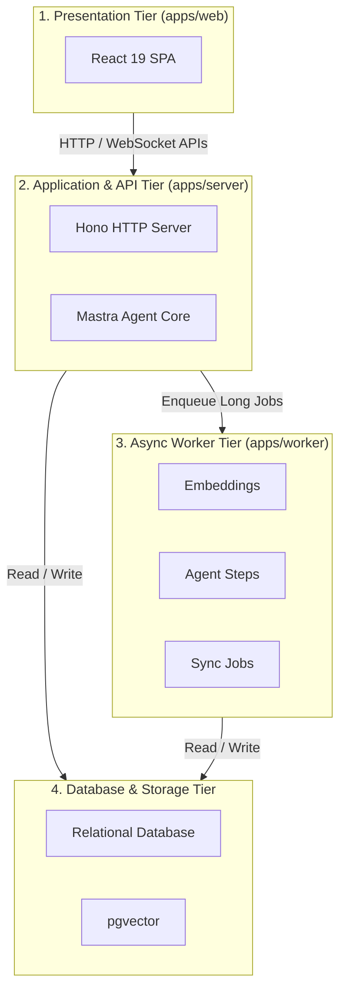
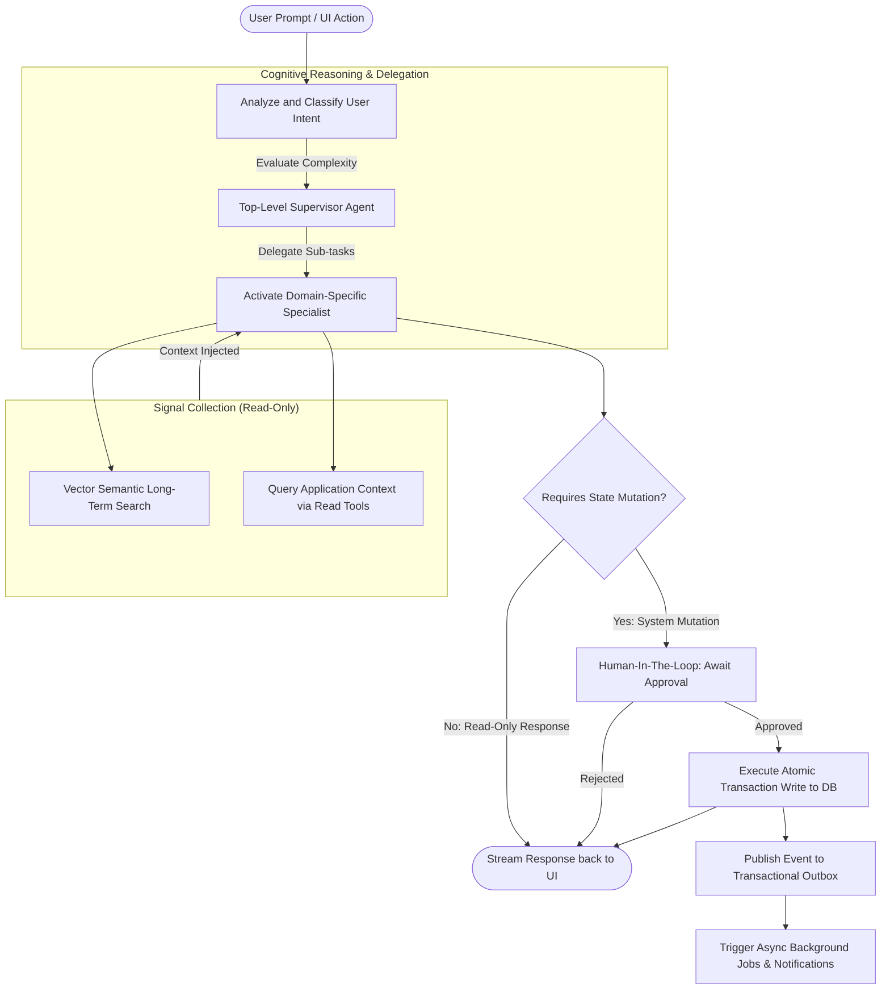
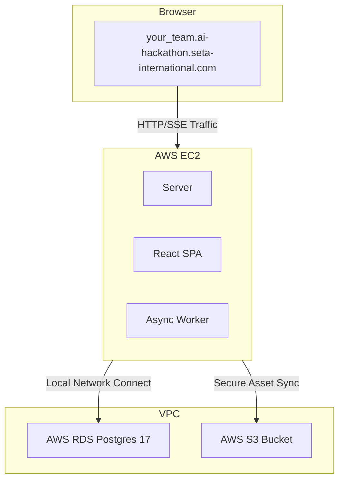

# Seta Agentic Platform

> **Architecture Reference:** For the complete implementation details and design principles, see [`docs/architecture.md`](docs/architecture.md). This is the single source of truth for the platform's implementation shape.

## 1. System Overview & Repo Structure

### What is Seta Agentic Platform?

Seta Agentic Platform is an open-source, AI-first, multi-tenant enterprise platform foundation. It's conceptually similar to next-gen ERP or SAP architectures, but built specifically for the agentic era.

The defining characteristic is simple. Every business module in the Seta Agentic Platform embeds an Agentic Agent directly within its operational boundaries. Rather than acting as a simple QA chatbot, the agent reads current system state, reasons across domains, and proposes concrete transactional actions. Upon explicit human authorization, it executes those mutations directly.

### Layered Architecture

The platform architecture is organized into four decoupled tiers. This design ensures horizontal scalability and clear separation of concerns:



- **SPA** (`apps/web/`): Built on React 19, Vite, and TanStack Router. It manages the core UI layout shell, handles dynamic injection of custom module components, and registers client-side navigation.
- **Server** (`apps/server/`): A high-performance Hono HTTP server acting as the gateway. It handles request authentication, enforces RBAC middleware checks, orchestrates REST APIs, and runs the Mastra agent core.
- **Worker** (`apps/worker/`): A resource-isolated process powered by graphile-worker. It processes async database tasks, generates text vector embeddings, handles calendar sync, and runs asynchronous workflow steps.
- **Database** (Postgres 17): Stores standard relational application data with schemas for Core, Identity, Planner, and your custom modules. It also includes a dedicated pgvector HNSW index for fast semantic similarity search.

### Core Agent Engine (Mastra Integration)

The platform backend wraps and configures key modules from the Mastra runtime:

- Specialist Agent and Tool declarations via `@mastra/core`
- Deterministic multi-step process orchestration via `@mastra/core/workflows`
- Short-term memory and long-term context indexing via `@mastra/memory` and `@mastra/pg`
- System response auditing and testing via `@mastra/evals`

The platform architecture remains flexible. While Mastra is configured by default, you can implement or plug in alternative agent frameworks if your use case requires it.

### Folder Directory Layout

```
├── apps/
│   ├── web/          React 19 SPA — module views, app shell, navigation
│   ├── server/       Hono API + Mastra agent host
│   ├── worker/       graphile-worker async jobs
│   └── cli/          scaffolding & infra tooling
│
├── packages/
│   ├── core/         event bus + RBAC foundation (everything depends on it)
│   ├── identity/     auth, multi-tenancy, user profiles
│   ├── planner/      REFERENCE MODULE — canonical business module
│   ├── agent/        the assembled Mastra agent (supervisor + specialists)
│   ├── knowledge/    knowledge base & document management
│   ├── staffing/     resource allocation & team management
│   ├── notifications/ multi-channel notifications
│   ├── integrations/ external systems (M365, etc.)
│   ├── shared-*/     shared infra (db, rbac, ui, crypto, storage, …)
│   └── your-module/  BUILD YOUR CUSTOM MODULE HERE
│
├── sdks/
│   ├── agent/        SDK for authoring agent tools (HITL support)
│   └── module/       SDK for plugging module UI into the app shell
│
└── docs/             guides indexed below
```

**Documentation:**
- **[`docs/architecture.md`](docs/architecture.md)** — system architecture & design principles (single source of truth)
- **[`docs/agent-architecture.md`](docs/agent-architecture.md)** — three-tier supervisor agent system
- **[`docs/dev-quickstart.md`](docs/dev-quickstart.md)** — local setup & first run
- **[`docs/creating-modules.md`](docs/creating-modules.md)** — building a module with `pnpm gen module`
- **[`docs/hosting/`](docs/hosting/)** — self-hosting (Docker Compose, AWS, scaling, upgrades)
- **[`AGENTS.md`](AGENTS.md)** — contract for AI coding agents working in this repo

---

## 2. Getting Started

**Prerequisites:** Node 24 LTS, pnpm 11+, and Docker running.

```bash
git clone https://github.com/Seta-International/agent-platform.git && cd agent-platform
pnpm install
cp .env.example .env     # then fill BETTER_AUTH_SECRET, CRYPTO_LOCAL_MASTER_KEY, OPENAI_API_KEY
pnpm db:up               # Postgres + Redis + telemetry, all in Docker
pnpm db:migrate          # apply every module's schema
pnpm db:seed             # load the demo tenant (~300 users, plans, tasks)
pnpm dev                 # serves the app at http://localhost:5173
```

Sign in at <http://localhost:5173/login> as `admin@hackathon.com` / `ChangeMe@2026`.

New here? The full walkthrough — secret generation, env reference, data-loading
options, and troubleshooting — is in **[`docs/dev-quickstart.md`](docs/dev-quickstart.md)**.
To build a business module, see **[`docs/creating-modules.md`](docs/creating-modules.md)**.

---

## 3. Agent Runtime Architecture

### Conceptual Runtime Flow

An agentic request follows a recurring cycle. This high-level representation does not reference explicit file configurations or database queries.



### Detailed request flow

For the full step-by-step sequence — request ingestion, RBAC, specialist delegation, read-tool context gathering, HITL approval, and the transactional outbox commit — see **[`docs/agent-architecture.md`](docs/agent-architecture.md)**.

---

## 4. Hackathon & Cloud Deployment

> This section is specific to deploying on the Seta hackathon AWS environment.
> For local development use [§2 Getting Started](#2-getting-started); for general
> self-hosting (Docker Compose, AWS, scaling, upgrades) see [`docs/hosting/`](docs/hosting/).

> Each hackathon team is allocated a secure, isolated cloud sandbox environment in AWS.

### Allocated Cloud Architecture per Team



### Deployment Pipeline

1. **Fork & Configure:** Fork the repository to your team workspace and configure production secrets (database URLs, LLM API keys, and session tokens).
2. **Build & Push to ECR:** Build the root multi-stage Dockerfile (frontend static assets build and backend compilation bundle) and push the image to your dedicated AWS ECR repository.
3. **Deploy to EC2:** SSH into your assigned AWS EC2 instance, pull the fresh image from ECR, and restart the container (structural migrations run automatically on container startup). Configure static assets to map to AWS S3.
4. **Verify Route:** Access your live environment via your team-specific endpoint: `<your_team>.ai-hackathon.seta-international.com`
