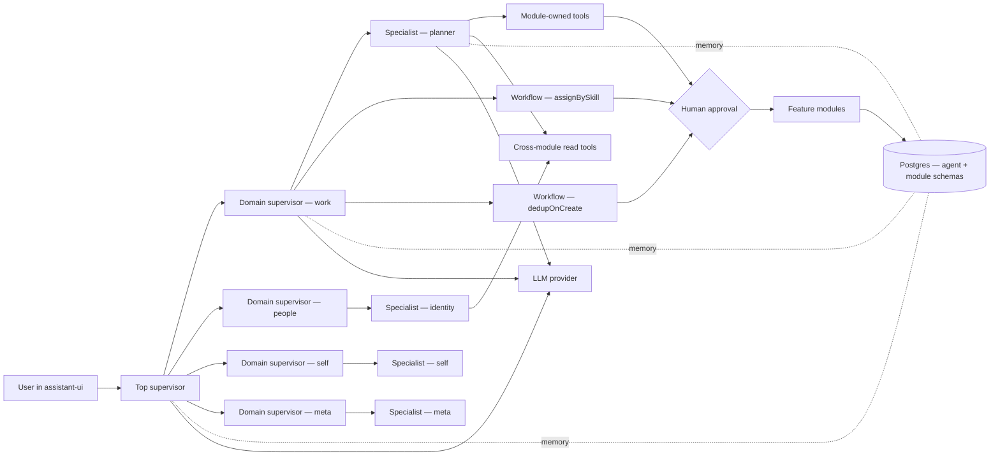
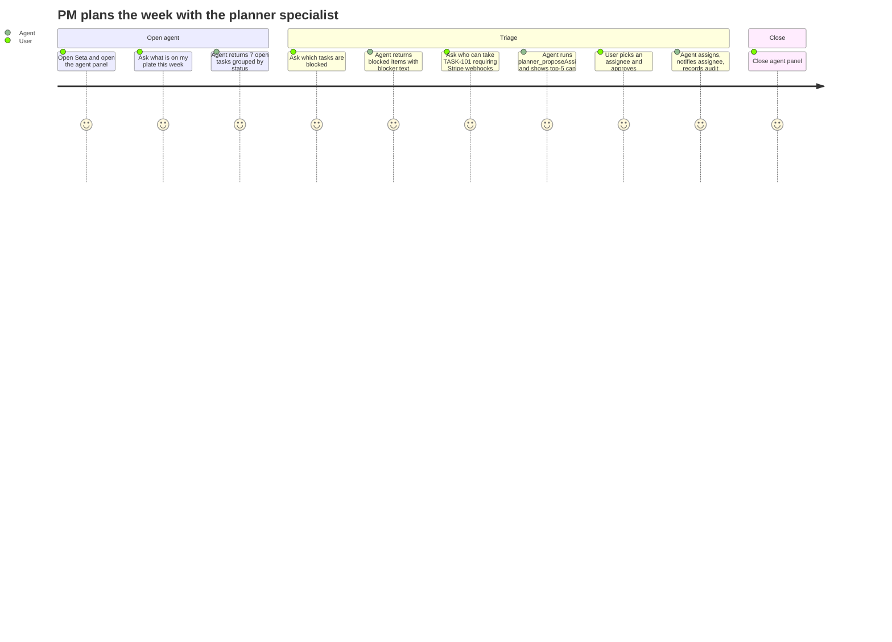
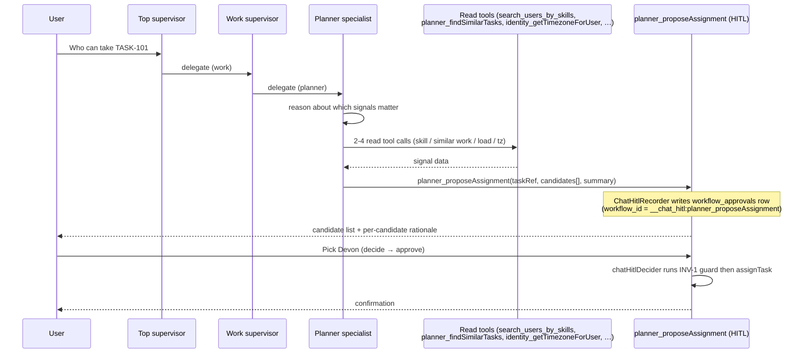
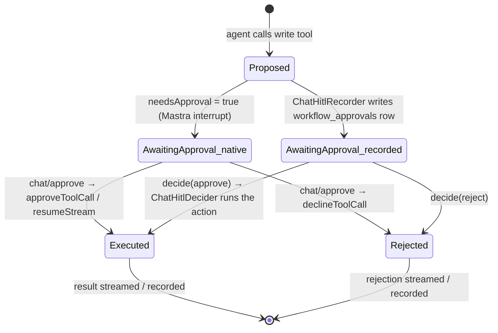
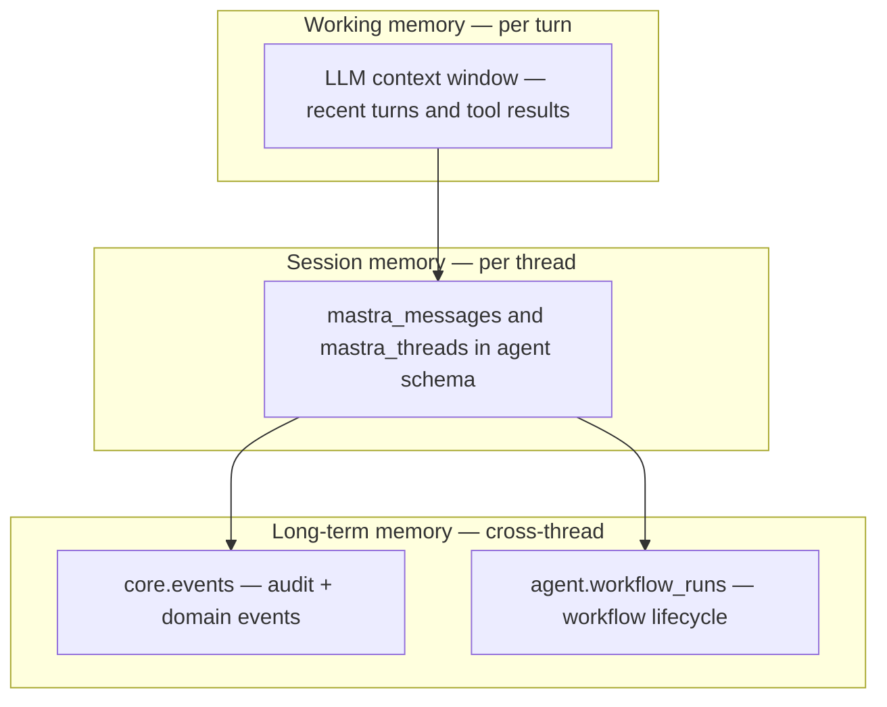
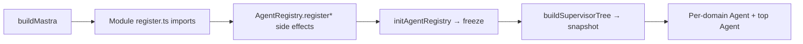
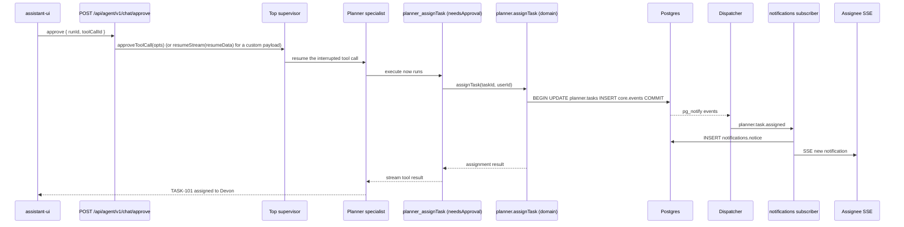
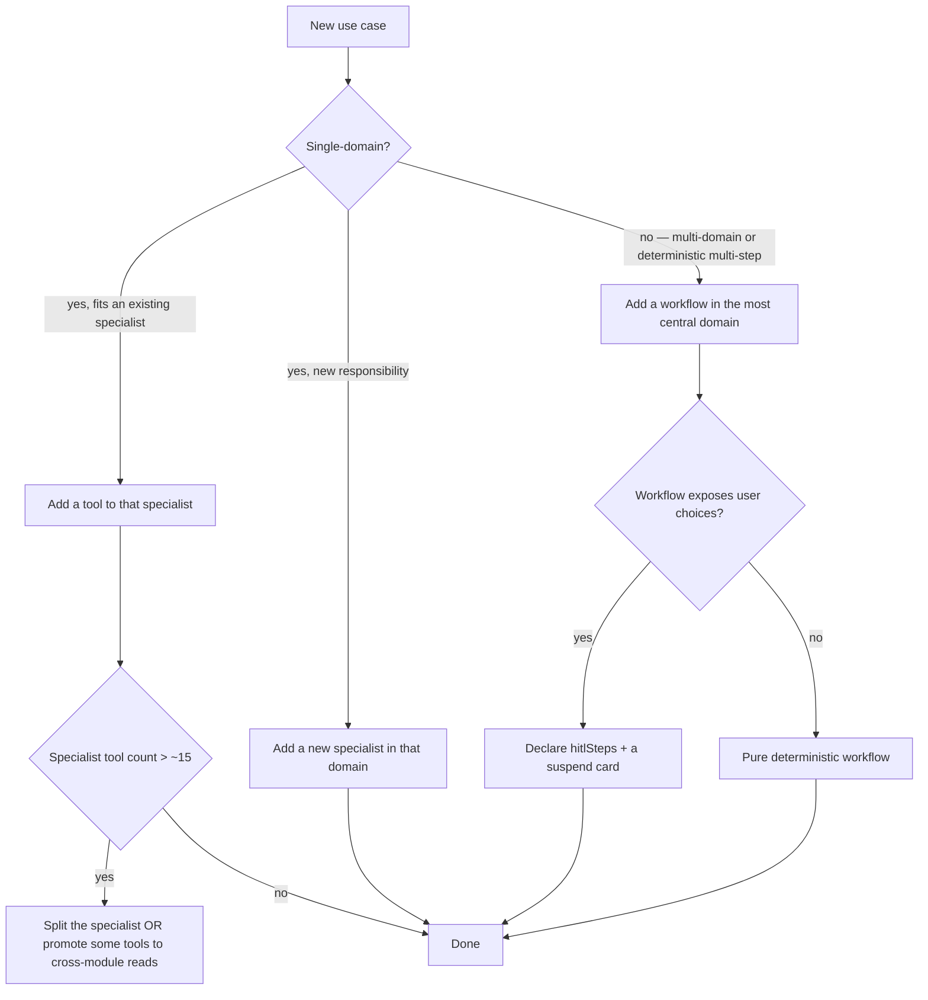

# Agent system

Seta's agent system is a **three-tier supervisor tree**: a top router selects a domain, a domain supervisor coordinates the specialists and workflows registered in that domain, and each specialist is a Mastra `Agent` composed from a curated tool record. Every write tool is gated by an explicit human-in-the-loop approval; every workflow step is audited and replayable through the same event bus as the rest of the platform.

This document explains the design by tracing one realistic workload — planner assignment assistance for a product manager — from user pain point through to implementation. The planner is used as the running example because it exercises every layer the system offers: a specialist with read and HITL-gated write tools, a deterministic multi-step workflow (`assignBySkill`), and cross-module read tools owned by `identity`.

**Related documents.** [`architecture.md`](./architecture.md) describes the surrounding platform shape (modules, event bus, identity). [`tech-stack.md`](./tech-stack.md) records the rationale for Mastra, AI SDK v6, and assistant-ui. [`creating-modules.md`](./creating-modules.md) is the module-author guide.

> **Scope note.** Every layer described below — top router, domain supervisors, the `planner` / `identity` / `self` / `meta` specialists, the `assignBySkill` and `dedupOnCreate` workflows, and the cross-module read tools — is wired up in the codebase today. Code locations are listed in §19.

---

## Contents

| Part | Subject |
|---|---|
| [A. Pain point](#part-a--pain-point) | Personas, current-tool gaps |
| [B. Use case](#part-b--use-case) | Target user story and required capabilities |
| [C. Design](#part-c--design) | Three-tier supervisor tree, registry, HITL boundary, memory, workflows, observability |
| [D. Implementation](#part-d--implementation) | Specialist registration, tool definitions, workflow shells, web surface, end-to-end run |
| [E. Production concerns](#part-e--production-concerns) | Failure modes, latency and cost budgets, extension criteria |

---

## Agent system at a glance



| Layer | Responsibility |
|---|---|
| User-facing chat | Message stream, tool-call cards, approval cards rendered by assistant-ui |
| Agent HTTP | A single route bridges the AI SDK v6 stream protocol to Mastra |
| Top supervisor | Routes the request to exactly one domain (`work` / `people` / `self` / `meta`) |
| Domain supervisor | Coordinates specialists and workflows registered in that domain |
| Specialist | Domain-scoped Mastra `Agent` composed from a tool record + a domain-specific system prompt |
| Tools | Thin adapters over module domain functions, owned by the source module |
| Cross-module read tools | Read-only contracts a module exposes for any specialist to call without a cross-module import |
| Workflows | Deterministic multi-step flows registered with the domain; emit lifecycle events into `agent.workflow_runs` |
| HITL gate | Pauses every write tool and every approving workflow step for explicit user decision |
| Modules | Perform the actual reads and mutations through their public surfaces |
| Memory | Threads, messages, and traces persisted to the `agent` Postgres schema, managed by Mastra |
| Audit | Workflow lifecycle, approvals, and domain events recorded across `core.events`, `agent.workflow_runs`, and `agent.workflow_approvals` |

The rest of this document explains *why* this shape — starting from a concrete user pain — and *how* it is built. Code locations for each layer are listed in §19.

---

# Part A — Pain point

## 1. Affected personas

| Persona | Recurring workload |
|---|---|
| **Product Manager** | Weekly status compilation, re-prioritisation, and ad-hoc capacity queries across multiple ICs. Frequent context switches between board views, chat, and email. |
| **Tech Lead / IC** | Task hygiene (closing stale items, updating status), interrupt-driven status reporting for stakeholders. |
| **Engineering Manager** | Assigning new work to individuals with matching skills and available capacity. Frequently defaults to familiarity heuristics, under-utilising newer team members. |

These workloads are information-retrieval and coordination problems mediated through chat, dashboards, and email. The latency and lossiness of these channels is the cost being optimised.

## 2. Gap analysis

| Existing tool | Limitation for the workloads above |
|---|---|
| Jira / Linear filter views | Surface items by attribute. Cannot answer intent-shaped queries such as "who is free next week with the skills required for a Stripe webhook integration". |
| Team chat | High latency, lossy, recipient must be online. |
| Spreadsheets | Snapshot in time; immediately stale. |
| General-purpose LLM chat (ChatGPT, Claude.ai) | No access to tenant data, no write authority, no audit. |
| LLM with retrieval over docs | Read-only. Cannot assign, update status, or notify. |

The gap is a per-tenant agent that can read the planner, search team members by skill, propose assignments, and apply them after a one-click human approval — with the resulting action audited and the assignee notified through the existing event channels.

---

# Part B — Use case

## 3. Target user story



The target end-to-end duration is approximately five minutes for the full interaction, compared with the 60–90 minutes typically required when the same workflow is performed manually across chat, board views, and email.

## 4. Required capabilities

| Capability | Source module | Side effect | Permission slug |
|---|---|---|---|
| List my tasks | `planner` | read | `planner.task.read` |
| Fetch task detail (blockers, dependencies) | `planner` | read | `planner.task.read` |
| Semantic search across tasks | `planner` (embedding index) | read | `planner.task.read` |
| Suggest assignee by skill + history + load + tz (HITL card) | `planner` (calls cross-module reads from `identity`) | proposes write | `planner.task.assign` |
| Apply chosen assignment | `planner` | write to `planner.tasks.assignee_id` | `planner.task.assign` |
| Notify assignee | `notifications` (event-driven projection) | write (via subscriber) | governed by event |
| Audit every action | `core.events` + `agent.workflow_runs` | write (via outbox + lifecycle hook) | automatic |

---

# Part C — Design

## 5. Architectural alternatives

| Design | Tool catalogue per agent | Prompt cache behaviour | Routing quality | Selected |
|---|---|---|---|---|
| Single agent with the full tool catalogue | Grows past 50 entries as modules are added | Tool schemas in system prompt invalidate the cache on every catalogue change | Degrades as catalogue grows | No |
| One agent per tool (router-only composition) | One tool per agent | Minimal prompt, optimal cache | No surface for domain reasoning | No |
| Two-tier supervisor → specialists | ~15 tools per specialist | Specialist prompt caches | Supervisor selects specialist directly | Was the previous design |
| **Three-tier top → domain supervisor → specialist** | Specialist prompts stay small; domain supervisor adds workflow-vs-specialist routing | Both supervisor prompts cache; specialist tool record is the only thing that changes with module updates | Top router picks one of four fixed domains (high precision); domain supervisor picks a specialist or workflow within scope | **Yes** |

The third tier exists for two reasons:

1. **Workflows live next to specialists.** A domain often has both an interactive specialist (planner) and one or more deterministic multi-step workflows (`assignBySkill`, `dedupOnCreate`) — the domain supervisor decides which is the right entry point for a given request.
2. **Bounded routing surface.** Each agent in the tree picks from a small, stable set: the top supervisor picks one of four domains, the domain supervisor picks among a handful of specialists and workflows. Adding a new module rarely changes any prompt at all — it adds a leaf.

## 6. Request flow

In chat, the specialist agent **reasons** over its primitive tool palette and
decides which signals to fetch for the request in front of it. The workflow
registry exists for the REST surface (`/workflows/runs/:id/start`) and the
workflow inbox; the chat agent never invokes a workflow directly — workflows
are not in any specialist's tool record.



## 7. Specialist composition

A specialist is a Mastra `Agent` built dynamically at boot from a `SpecialistSpec` (`@seta/agent-sdk`). Modules register their specialists at module load time via `AgentRegistry.registerSpecialist(...)`; the registry is frozen once before the supervisor tree is built.

| Ingredient | Source | Scope |
|---|---|---|
| Domain | `SpecialistSpec.domain` — one of `'work' \| 'people' \| 'self' \| 'meta'` | Per specialist |
| System prompt | `SpecialistSpec.instructions(ctx)` — invoked at agent build time | Per specialist |
| Tool record | `SpecialistSpec.tools: Record<string, AgentTool>` | Per specialist |
| Workflows | `SpecialistSpec.workflows?` (rarely set on the specialist; usually registered at the domain level) | Per specialist |
| Memory store | `@mastra/pg` `PostgresStore({ schemaName: 'agent' })`, wrapped in `Memory` with sliding window, semantic recall, and working memory | Shared store, per-user resource scope |
| Model | `resolveModel('auto', { tierHint: 'fast' })` at the specialist layer (`balanced` at the supervisor layers) | Per agent |

The four domains are fixed because the top router prompt is parameterised over them. Adding a new domain is a deliberate change — adding a new specialist or workflow in an existing domain is not.

## 8. Tool catalogue and RBAC binding

The planner specialist composes tools owned by `planner` and `identity`. Tool IDs are unique per specialist record; cross-module reads use a separate, more constrained contract.

| Tool ID | Owning module | Side effect | Permission | Author shape |
|---|---|---|---|---|
| `identity_whoAmI` | `identity` | read | `identity.user.read` | agent tool |
| `planner_getTask` | `planner` | read | `planner.task.read` | agent tool |
| `planner_createTask` | `planner` | write (dedup-aware) | `planner.task.create` | agent tool (executes; dedup workflow carries HITL) |
| `planner_proposeAssignment` | `planner` | proposes write | `planner.task.assign` | agent tool (chat HITL via `ChatHitlRecorder`) |
| `planner_assignTask` | `planner` | write | `planner.task.assign` | agent tool (`needsApproval`) |
| `planner_setAssignees` | `planner` | write | `planner.task.assign` | agent tool (`needsApproval`) |
| `planner_findSimilarTasks` | `planner` | read | `planner.task.read` | agent tool |
| `search_users_by_skills` | `identity` | read | `identity.user.read` | agent tool |
| `planner_getOpenTaskCountForUser` | `planner` | read | `planner.task.read` | cross-module read tool |
| `identity_getTimezoneForUser` | `identity` | read | `identity.user.read` | cross-module read tool |
| `identity_getAvailabilityForUser` | `identity` | read | `identity.user.read` | cross-module read tool |

Each agent tool calls `registerToolPermission(tool, slug)` (done inside `defineAgentTool` when `rbac` is set). At the HTTP boundary the `agent.chat.use` permission gates access to the chat route; per-tool RBAC slugs are enforced inside each tool's `execute` against the resolved session, and per-workflow permissions are enforced inside domain functions for the workflow management endpoints. There is no separate runtime filter that hides tools from the model — the model sees the full specialist tool record, and unauthorised executions are rejected at the domain boundary.

## 9. Human-in-the-loop boundary

HITL has three shapes today, all audited. Two govern the chat path; the third governs programmatic workflow runs.

**Chat shape 1 — `needsApproval` tools (Mastra native approval).** A write tool sets `needsApproval: true` (e.g. `planner_assignTask`, `planner_setAssignees`). Mastra interrupts the tool call before `execute` runs and surfaces an accept/reject card derived from the input schema. The client posts the decision to `POST /api/agent/v1/chat/approve`; the route calls `approveToolCall` / `declineToolCall` on the top supervisor (or `resumeStream(resumeData)` when a custom resume payload is supplied) and streams the continuation back.

**Chat shape 2 — `ChatHitlRecorder` tools.** A write tool that must show a richer, multi-candidate card (e.g. `planner_proposeAssignment`) deliberately does *not* call `ctx.agent.suspend()` — a suspended tool call never reaches the `'workflows'` pubsub channel, so no `agent.workflow_approvals` row would be written and the card would never appear. Instead the tool builds an `ApprovalCard` and calls the `ChatHitlRecorder` injected into `requestContext` (key `RC_CHAT_HITL_RECORDER`) by the chat route. The recorder writes `workflow_runs` + `workflow_approvals` in one transaction under a synthetic `workflow_id = '__chat_hitl:planner_proposeAssignment'`, and the tool returns `{ kind: 'pending-approval' }` so the turn completes. The user decides via the same decide-approval path as workflows; because the `workflow_id` carries the `__chat_hitl:` prefix, `decide-approval` dispatches to the registered `ChatHitlDecider` (`chatHitlDeciders`) for that tool, which executes the assignment directly (no Mastra resume).



**Chat shape 0 — direct execution.** `planner_createTask` sets neither `needsApproval` nor a recorder: it executes `createTask` immediately, then fire-and-forgets the `dedupOnCreate` workflow, which carries its own `hitlSteps` approval if a duplicate is found.

**Workflow-step approvals.** A workflow declares `hitlSteps: string[]` on its `WorkflowSpec`. The lifecycle hook writes a row into `agent.workflow_approvals` when one of those steps suspends; users decide via `POST /api/agent/v1/workflows/approvals/:approvalId/decide` (decision `approve | reject | modify`, with optional `overrideUserId` and `note`).

| Property | Behaviour |
|---|---|
| Read tools | Execute directly without approval |
| Write tools | Either gate via `needsApproval` (Mastra interrupt) or via a `ChatHitlRecorder` card; `planner_createTask` executes directly and defers HITL to its dedup workflow |
| Approval surface | Card schema is either the tool input schema (`needsApproval`) or the `ApprovalCard` payload written by the recorder |
| Rejection | `needsApproval` → streamed back as a tool decline; recorder/workflow → persisted to `agent.workflow_approvals`; the agent may re-plan |
| Replay & rerun | Workflows support `rerun` (new run, same input or override) and `replayFromStep` (continue from a specific step) |
| Audit | Tool calls and workflow lifecycle events both land in `core.events`; workflow runs are also materialised in `agent.workflow_runs` with idempotency in `agent.workflow_run_events_seen` |

The approval boundary is a trust contract, not a UX option: agent-driven mutations always present the proposed action to the user before commit.

## 10. Memory model



| Layer | Lifetime | Storage | Contents |
|---|---|---|---|
| Working | One turn | LLM context window | Recent messages, current tool results |
| Session | Per thread | `agent.mastra_messages`, `agent.mastra_threads` (Mastra-managed) | Full conversation history including tool calls and suspended approvals |
| Long-term | Subject to event retention | `core.events`, `agent.workflow_runs`, `agent.workflow_approvals` | Tool execution audits, emitted domain events, workflow lifecycle, approval decisions |

The `mastra_*` tables are owned by Mastra; their DDL is not edited by hand. They reside in the `agent` schema so that backup and migration operations cover them with the rest of the platform. The thread/message API used by the UI is exposed through `GET /api/agent/v1/threads`, `GET /api/agent/v1/threads/:id`, `PATCH /api/agent/v1/threads/:id`, and `DELETE /api/agent/v1/threads/:id`; the route maps Mastra's stored `tool-invocation` parts to AI SDK v6's `tool-<name>` parts at read time.

`Memory` uses a sliding window of `AGENT_MEMORY_LAST_MESSAGES` (default 20) recent messages per turn. Semantic recall (`scope: 'resource'`, `topK: 5`) embeds each incoming message and retrieves the most relevant past messages across all of the user's threads via a `PgVector` HNSW index in the `agent` schema. Working memory (`scope: 'resource'`) maintains a per-user Markdown profile (timezone, communication style, current focus) in `agent.mastra_resources`, injected into every turn. Thread titles are generated automatically (`generateTitle: true`).

---

# Part D — Implementation

## 11. Planner specialist registration

The planner specialist's `instructions` is a **playbook** that names the
signals available and tells the LLM when each is material. It does not
script a fixed pipeline. The cross-module reads (open task count, timezone,
availability) are promoted to specialist tools via `defineCrossModuleReadAsTool`
so the LLM can call them directly while session is still derived from
`requestContext`.

```ts
// packages/planner/src/backend/agent-tools/register.ts (shape)
AgentRegistry.registerSpecialist({
  domain: 'work',
  id: 'planner',
  description:
    'Plans, tasks, buckets, assignments. Reads across identity for skill, ' +
    'timezone, and availability when assignment decisions need those signals.',
  instructions: () => `… reasoning playbook (see register.ts) …`,
  tools: {
    // Read tools (the agent picks which to call per-request)
    planner_getTask,
    planner_findSimilarTasks,
    search_users_by_skills,
    planner_getOpenTaskCountForUser,    // promoted via defineCrossModuleReadAsTool
    identity_getTimezoneForUser,        // promoted via defineCrossModuleReadAsTool
    identity_getAvailabilityForUser,    // promoted via defineCrossModuleReadAsTool
    // Write tools (HITL)
    planner_createTask,                 // thin confirm-and-create
    planner_assignTask,                 // one-click confirm
    planner_proposeAssignment,          // 2-5 candidates with rationale
  },
});

// Workflows live in the registry for the REST + audit surface only — they
// are NOT in any specialist's tool record.
AgentRegistry.registerWorkflow(dedupOnCreateWorkflowSpec);
AgentRegistry.registerWorkflow(assignBySkillWorkflowSpec);

// Original spec stays registered for non-LLM callers (workflows, REST).
AgentRegistry.registerCrossModuleReadTool(plannerGetOpenTaskCountSpec);
```

No `session` field appears in any LLM-visible input schema. Tools and workflow
steps derive session from `requestContext` via `actorFromContext` /
`sessionFromRequestContext`. Registering a workflow whose `inputSchema` has a
top-level `session` field throws at boot (`assertNoSessionField`).

`identity` mirrors this shape: it registers the `identity` specialist (people domain), the `self` specialist (self domain), and three cross-module read tools (`identity_searchUsersBySkillVector`, `identity_getTimezoneForUser`, `identity_getAvailabilityForUser`).

### Registry boot order



Side-effect imports in `packages/agent/src/backend/init-registry.ts` pull each module's `agent-tools/register.ts` so that every `AgentRegistry.register*` call happens before `freeze()`. After freeze, `snapshot()` is authoritative and `buildSupervisorTree` walks it to build the three-tier `Agent` graph.

| Failure condition | Boot outcome |
|---|---|
| Module forgets to call `register.ts` | Specialist absent from snapshot; domain supervisor (and the top router) treats the domain as empty |
| Specialist missing `description` | `registerSpecialist` throws at module load |
| Workflow spec missing fields | `registerWorkflow` throws at module load |
| Cross-module read tool missing `rbac` | `registerCrossModuleReadTool` throws at module load |
| Registration after `freeze()` | `RegistryFrozenError` |
| Snapshot before `freeze()` | `RegistryNotFrozenError` |

## 12. Planner tool definitions

Tool definitions reside in `packages/planner/src/backend/agent-tools/`. Each tool is a thin adapter over a `domain/*.ts` function — the agent execution path and any HTTP execution path call the same business logic.

| Tool ID | File | Wraps | RBAC | HITL shape |
|---|---|---|---|---|
| `identity_whoAmI` | `@seta/identity/agent-tools` | returns the current session user's `user_id` | `identity.user.read` | none |
| `planner_getTask` | `get-task.ts` | `getTask` | `planner.task.read` | none |
| `planner_findSimilarTasks` | `find-similar-tasks.ts` | `findSimilarTasks` (vector + assignee enrich + scope filter) | `planner.task.read` | none |
| `search_users_by_skills` | `search-users-by-skills.ts` | `searchUsersBySkills` (identity) | `identity.user.read` | none |
| `planner_getOpenTaskCountForUser` | `get-open-task-count.ts` | spec promoted via `defineCrossModuleReadAsTool` | `planner.task.read.tenant` | none |
| `identity_getTimezoneForUser` | `@seta/identity/agent-tools` | spec promoted via `defineCrossModuleReadAsTool` | `identity.user.read` | none |
| `identity_getAvailabilityForUser` | `@seta/identity/agent-tools` | spec promoted via `defineCrossModuleReadAsTool` | `identity.user.read` | none |
| `planner_createTask` | `create-task.ts` | `createTask` domain, then fire-and-forgets the `dedupOnCreate` workflow | `planner.task.create` | none on the tool itself; dedup workflow carries `hitlSteps` |
| `planner_assignTask` | `assign-task.ts` | `assignTask` | `planner.task.assign` | `needsApproval: true` |
| `planner_setAssignees` | `set-assignees.ts` | `setAssignees` (replace full assignee list) | `planner.task.assign` | `needsApproval: true` |
| `planner_proposeAssignment` | `propose-assignment.ts` | agent-reasoned candidate list → `ChatHitlRecorder`; INV-1 guard + `assignTask` run in the `ChatHitlDecider` on approval | `planner.task.assign` | `ChatHitlRecorder` card (synthetic `__chat_hitl:planner_proposeAssignment` approval) |

`defineAgentTool` is the authoring helper — it wraps `@mastra/core/tools.createTool`, registers the RBAC slug, attaches `needsApproval` when set, and surfaces a friendly `displayName` for the UI:

```ts
// packages/planner/src/backend/agent-tools/assign-task.ts (excerpt)
export const plannerAssignTaskTool = defineAgentTool({
  id: 'planner_assignTask',
  name: 'Assign Task',
  description: 'Assign a user to a task.',
  input: z.object({
    taskId: z.string().uuid().describe('The task ID'),
    assigneeUserId: z.string().uuid().describe('The user ID to assign'),
  }),
  output: z.object({ assignment: z.object({ taskId: z.string(), assigneeUserId: z.string() }) }),
  rbac: 'planner.task.assign',
  needsApproval: true,
  execute: async (input, ctx) => {
    const session = await buildActorSession(actorFromContext(ctx));
    await assignTask({ task_id: input.taskId, user_id: input.assigneeUserId, session });
    return { assignment: { taskId: input.taskId, assigneeUserId: input.assigneeUserId } };
  },
});
```

The `planner_proposeAssignment` tool uses the richer multi-candidate shape, but deliberately *not* via `ctx.agent.suspend()` (a suspended agent-tool call never reaches the `'workflows'` pubsub channel, so no approval row would be written — see the comment in `propose-assignment.ts`). Instead it builds a 1–5 candidate `ApprovalCard` and calls the `ChatHitlRecorder` from `requestContext`, which writes a `workflow_approvals` row under the synthetic `workflow_id = '__chat_hitl:planner_proposeAssignment'`. The tool returns `{ kind: 'pending-approval' }`; when the user decides, the decide-approval path dispatches to the registered `ChatHitlDecider`, which runs the INV-1 guard and `assignTask` directly. The deterministic ranking on the REST/inbox path lives in the `assignBySkill` *workflow* (steps `assignBySkill.compute` / `assignBySkill.suggest`), which is a distinct surface — not a specialist tool.

## 13. Supervisor tree wiring

```ts
// packages/agent/src/backend/supervisor-tree.ts (shape only)
export function buildSupervisorTree(opts: { mastra?: Mastra } = {}): Agent {
  const snapshot = AgentRegistry.snapshot();
  const memory = buildMemory(opts.mastra);                  // shared Memory({ storage })
  const domainAgents: Record<string, Agent> = {};
  for (const d of snapshot.domains) {
    domainAgents[d] = buildDomainSupervisor(d, memory);     // tier 2
  }
  return new Agent({                                         // tier 1 (top)
    id: 'top-supervisor',
    name: 'Supervisor',
    instructions: generateTopRoutingPrompt(snapshot),
    model: resolveModel('auto', { tierHint: 'balanced' }).model,
    agents: domainAgents,
    memory,
  });
}
```

Each domain supervisor is itself an `Agent` whose `agents` field is the specialists in that domain and whose `workflows` field is the workflows registered in that domain. The prompt for each tier is generated from the registry snapshot (`generateTopRoutingPrompt` / `generateDomainPrompt`), so adding a specialist or workflow updates the prompt automatically.

| Boot-time validation | Effect |
|---|---|
| `snapshot()` called without `freeze()` | `RegistryNotFrozenError` (fail fast at boot) |
| Specialist `instructions(ctx)` throws | Bubbles up on agent construction |
| Workflow `inputSchema` invalid | `registerWorkflowInputSchema` rejects on register |
| Mastra storage unreachable | `PostgresStore` surfaces the error from `/api/agent/v1/health` |

## 14. Workflows alongside specialists

Workflows live in the registry for the REST surface and audit, not the chat
path. The chat agent does not see them — workflows are absent from every
specialist's tool record. Each module's `register.ts` calls
`AgentRegistry.registerWorkflow(spec)` once per workflow.

```ts
// packages/planner/src/backend/workflows/assign-by-skill/spec.ts
export const assignBySkillWorkflowSpec: WorkflowSpec = {
  domain: 'work',
  id: 'assignBySkill',
  description: 'Suggest an assignee by skill overlap + vector match + history + load + tz; HITL required.',
  inputSchema: AssignBySkillInputSchema,
  outputSchema: AssignBySkillOutputSchema,
  workflow: assignBySkillWorkflow,         // Mastra workflow built with createWorkflow / createStep
  hitlSteps: ['assignBySkill.run'],
};
```

At boot, the platform wires Mastra's pubsub channels `workflows` and `workflows-finish` to a single lifecycle hook (`workflows/_infra/lifecycle-hook.ts`) that:

- Inserts/updates a row in `agent.workflow_runs` for the run (status, step, started/finished).
- Records a row in `agent.workflow_run_events_seen` keyed on `(runId, eventId)` for idempotency.
- Creates a row in `agent.workflow_approvals` when a `hitlSteps` step suspends.

The chat path uses the agent-tool HITL contract (suspend + `chat/approve`). Programmatic workflow runs use the workflow HITL endpoints (`/workflows/approvals/:id/decide`, `/workflows/runs/:id/rerun`, `/workflows/runs/:id/replay-from-step`, `/workflows/runs/:id/cancel`). Both produce identical audit trails because the lifecycle hook is on the Mastra publish path, not the API path.

The deterministic `assignBySkill` ranking is still reachable from the workflow
inbox (the "Suggest" button on a task card kicks off a workflow run via REST).
The chat path reaches the same outcome through specialist reasoning + the
`planner_proposeAssignment` HITL tool. The two surfaces share the
`AssignBySkillOutputSchema` discriminated union (`assigned` / `superseded` /
`left-unassigned` / `declined`).

## 15. Cross-module read tools

A module that wants to expose a read for any specialist to call — without forcing every caller into a cross-module import — registers a `CrossModuleReadToolSpec`:

```ts
// packages/planner/src/backend/agent-tools/get-open-task-count.ts (shape)
export const plannerGetOpenTaskCountSpec: CrossModuleReadToolSpec = {
  id: 'planner_getOpenTaskCountForUser',
  description: 'Count of open planner tasks assigned to a given user.',
  inputSchema: z.object({ userId: z.string().uuid() }),
  outputSchema: z.object({ count: z.number().int().nonnegative() }),
  rbac: 'planner.task.read.tenant',
  availableTo: 'all-specialists',
  execute: async ({ session, input }) => { /* … */ },
};
```

These tools differ from specialist tools in three ways: (1) they are owned by their source module but consumable from any specialist's domain, (2) they take a typed `{ session, input }` instead of Mastra's ToolExecutionContext, and (3) they cannot mutate. The `assignBySkill` workflow uses them to combine `identity` data (timezone, availability) with `planner` data (open task count) without dragging the `planner` package into `identity`, or vice versa.

## 16. Web surface and HTTP routes

The chat panel is anchored to the right edge of the application shell. The approval card is rendered inline within the conversation: for `needsApproval` tools it is derived from the input schema and decided via `chat/approve` (`approveToolCall` / `declineToolCall`); for `ChatHitlRecorder` tools the recorder-written `ApprovalCard` payload is rendered through the `ApprovalCard` UI contract (`sdks/agent/src/hitl/card.ts`), which supports candidate rows, detail blocks, and a chosen-action payload submitted to the decide-approval endpoint.

```
┌────────────────────────────────────────────────────────────┐
│ Agent                                  [Auto ▾]     [×]  │
├────────────────────────────────────────────────────────────┤
│ User:    who can pick up TASK-101 - Stripe webhooks?       │
│ Planner: top-5 candidates by skill + load + tz             │
│                                                            │
│ ┌────────────────────────────────────────────────────────┐ │
│ │ Suggested assignees for TASK-101                       │ │
│ │ ● Devon  — skills:0.92  load:3  tz:CET  ✓ recommended  │ │
│ │ ○ Aki    — skills:0.81  load:1  tz:JST                 │ │
│ │ ○ Sam    — skills:0.78  load:5  tz:EST                 │ │
│ │ ○ …                                                    │ │
│ │                 [ Decline ]   [ Assign Devon ⏎ ]       │ │
│ └────────────────────────────────────────────────────────┘ │
│                                                            │
│ [ Compose message...                                   ↵ ] │
└────────────────────────────────────────────────────────────┘
```

| UI element | Source library |
|---|---|
| Panel shell | `@assistant-ui/react` |
| Message stream | `@ai-sdk/react` `useChat` with `@assistant-ui/react-ai-sdk` adapter |
| Tool-call card | `@assistant-ui/react` `<ToolCallContentPart>` |
| Approval card | assistant-ui Interactable, parameterised by either the input schema or the typed suspend payload |
| Markdown rendering | `@assistant-ui/react-markdown` |
| Model selector | Reads `GET /api/agent/v1/models`; `auto` is the synthetic default that lets the server pick a tier |

The route surface (all under `/api/agent/v1`):

| Method | Path | Purpose |
|---|---|---|
| POST | `chat` | Stream a turn through the top supervisor (UI message stream → AI SDK v6 via `@mastra/ai-sdk.toAISdkStream`) |
| POST | `chat/approve` | Approve / decline a suspended tool call; optional `resumeData` passthrough for typed cards |
| GET | `threads` | List the user's threads |
| GET / PATCH / DELETE | `threads/:id` | Read, rename, or delete a thread (translates Mastra `tool-invocation` parts to `tool-<name>` parts) |
| GET | `tools` | Deduped catalogue of every specialist's tools |
| GET | `models` | Available models with tier + reasoning support; synthetic `auto` entry first |
| GET | `health` | Model configured + storage reachable |
| GET | `workflows/runs` | Paginated workflow runs filtered by `scope=self\|group\|tenant\|instance` |
| GET | `workflows/runs/:runId` / `/snapshot` | Run row and Mastra snapshot |
| GET | `workflows/my-pending-approvals` | Pending approvals for the current user |
| POST | `workflows/approvals/:id/decide` | Decide `approve\|reject\|modify` with optional `overrideUserId` + `note` |
| POST | `workflows/runs/:id/rerun` / `/replay-from-step` / `/cancel` | Run-management actions |
| GET | `workflows/:id/input-schema` | Cached input schema for a workflow form |
| GET | `workflows/sse-token` | Issue a short-lived token for SSE auth |
| SSE | `workflows/runs/:id/events`, `workflows/inbox` | Live run events and per-user inbox (mounted by `mountRunSse` / `mountInboxSse`) |

The chat route also performs two boundary transformations: (1) page-context injection — a `data-page-context` UI message part is folded into a `[Context: kind#id — "label"]` prefix on the most recent user text, so the agent gets the right anchor without the model having to interpret the part directly; and (2) rate limiting — `reserveTurn` debits a per-tenant/user budget (`agent.rate_limits` table) before invoking the model, returning HTTP 429 with `Retry-After` if the budget is exhausted.

## 17. End-to-end execution

The full path from user approval to assignee notification, shown for a `needsApproval` write tool (`planner_assignTask`) resumed through `chat/approve`:



For the `planner_proposeAssignment` candidate card the path differs: the user's decision posts to the workflow decide-approval endpoint, and the registered `ChatHitlDecider` runs the INV-1 guard and `assignTask` directly (no Mastra resume) before the same `planner.task.assigned` event → notification fan-out.

The p95 latency budget for this flow is approximately 1.2 s from approval click to the confirmation message, with an additional ~150 ms for the SSE notification to reach the assignee.

---

# Part E — Production concerns

## 18. Failure modes

| Failure | Detection | Recovery |
|---|---|---|
| LLM provider unavailable | Provider error returned to the tool layer; AI SDK v6 retries on transient errors | Model registry falls back via `resolveModel('auto', …)` to another model in the same tier |
| Tool implementation raises an unexpected exception | Mastra captures the exception and streams a tool error to the agent | Agent receives the error in context and re-plans or surfaces it to the user |
| User rejects approval | AI SDK v6 streams the rejection as a tool result; workflow path writes to `agent.workflow_approvals` | Agent receives the rejection and suggests alternatives |
| Dispatcher lag increases | `/health/ready` reports backlog | Scale `apps/worker`; investigate slow subscribers |
| Long-running tool blocks the specialist | Mastra timeout | Tool returns timeout; agent re-plans |
| Workflow run stuck in suspended state | `agent.workflow_approvals` row aging | `POST /workflows/runs/:id/cancel` or `replay-from-step` once unblocked |
| Workflow lifecycle event missed | Lifecycle hook is idempotent on `(runId, eventId)` in `agent.workflow_run_events_seen` | Duplicate emit safely no-ops; missed events recovered on next pubsub message or by re-snapshotting |
| Rate-limit budget exhausted | `reserveTurn` throws `RateLimitError`; route returns HTTP 429 with `Retry-After` | UI surfaces the wait |
| Mastra memory store unreachable at boot | `PostgresStore.ping`/`init` fails in `/api/agent/v1/health` | Cluster does not accept traffic — fail fast |
| Embedding job backlog | `embed_<entity>` job count in observability | Scale workers; throttle source; defer backfill |

## 19. Latency and cost budget

Per-turn p95 budget for a single planner turn that exercises both supervisors and the planner specialist:

| Stage | Latency | Token cost (balanced tier) | Notes |
|---|---|---|---|
| Top route | 120 ms | ~120 in, ~20 out | Balanced tier, four-domain choice |
| Domain route | 150 ms | ~200 in, ~30 out | Balanced tier, picks specialist vs workflow |
| Specialist plan | 450 ms | ~700 in, ~180 out | Fast tier; tool record in prompt |
| `planner_findSimilarTasks` | 250 ms | — | Stage 1 RRF + Stage 2 Cohere rerank |
| `search_users_by_skills` (or cross-module reads in workflow path) | 80 ms | — | Indexed query |
| `planner_assignTask` (post-approval) | 50 ms | — | Single transaction |
| Summary stream back to UI | 200 ms | ~300 in, ~120 out | Fast tier |
| **Total per turn** | **~1.3 s** | **~1.7 k tokens** | |

| Cost lever | Effect |
|---|---|
| Use `resolveModel('auto', …)` for specialists at `fast` tier | Default today; cheapest while retaining tool-use quality |
| Promote a specialist to `balanced` or `reasoning` for harder reasoning | Linear cost increase, modest latency increase |
| Disable rerank (`stage2: 'none'`) | ~150 ms saved; recall@10 drops 8–12 % |
| Cap thread context to last N messages | Linear reduction in token cost |
| Provider prompt caching (AI SDK v6) | First turn unaffected; subsequent turns benefit from cache hits, especially on the supervisor prompts |

## 20. Extension criteria — when to add a specialist or a workflow



| Precondition before merging a new specialist or workflow |
|---|
| All capabilities have a public function in the owning module |
| Each capability has a tool wrapper in that module's `agent-tools/` (specialist tools) or a `CrossModuleReadToolSpec` (cross-module reads) |
| Write tools set `needsApproval: true` *or* surface an `ApprovalCard` via the `ChatHitlRecorder` (with a registered `ChatHitlDecider`) — never `ctx.agent.suspend()` in the chat path |
| Workflows declare every approving step in `hitlSteps[]` |
| RBAC slugs are registered in `<module>/src/rbac.ts` and threaded through `defineAgentTool({ rbac })` |
| Specialist tool record contains no more than ~15 entries; otherwise split or move reads to cross-module |
| Specialist `description` reads as a job title, not a feature list |
| At least one integration test exercises the top → domain → specialist → tool → database path (or the workflow lifecycle path) |
| Latency and cost budget recorded in §19 |

## 21. Code locations

| Concept | File |
|---|---|
| Tool / spec contracts and registry (no runtime dependency on `@mastra/*`) | `sdks/agent/src/registry.ts`, `sdks/agent/src/tool.ts` |
| `defineAgentTool` helper | `sdks/agent/src/define-agent-tool.ts` |
| RBAC binding | `sdks/agent/src/rbac.ts` |
| HITL card schema (`ApprovalCard`, `CandidateRow`) | `sdks/agent/src/hitl/card.ts` |
| Request context + session types | `sdks/agent/src/request-context.ts`, `sdks/agent/src/session.ts` |
| Mastra runtime + lifecycle hook wiring | `packages/agent/src/backend/runtime.ts` |
| Three-tier supervisor build | `packages/agent/src/backend/supervisor-tree.ts` |
| Supervisor + domain prompts (generated from the registry snapshot) | `packages/agent/src/backend/prompt-templates.ts` |
| Module side-effect imports + `freeze()` | `packages/agent/src/backend/init-registry.ts` |
| Agent top-level registration (Mastra build, agents, workflows, routes) | `packages/agent/src/register.ts` |
| Model registry (`fast \| balanced \| reasoning`) | `packages/agent/src/backend/model-registry.ts` |
| Rate limit (`agent.rate_limits`) | `packages/agent/src/backend/rate-limit.ts` |
| Chat + workflow HTTP routes | `packages/agent/src/backend/routes.ts` |
| Workflow lifecycle hook | `packages/agent/src/backend/workflows/_infra/lifecycle-hook.ts` |
| Workflow input-schema registry | `packages/agent/src/backend/workflows/_infra/input-schema-registry.ts` |
| SSE — run + inbox | `packages/agent/src/backend/workflows/_infra/sse-run.ts`, `sse-inbox.ts` |
| Meta specialist registration | `packages/agent/src/backend/agent-tools/register-meta.ts` |
| Planner module registration (specialist + workflows + cross-module reads) | `packages/planner/src/backend/agent-tools/register.ts` |
| Planner agent tools | `packages/planner/src/backend/agent-tools/` |
| Planner workflows (`assignBySkill`, `dedupOnCreate`) | `packages/planner/src/backend/workflows/` |
| Identity module registration | `packages/identity/src/backend/agent-tools/register.ts` |
| Mastra source (API reference) | `/Users/canh/Projects/Seta/mastra/` (sibling checkout) |
| Mastra playground (UX reference for chat and uploads) | `/Users/canh/Projects/Seta/mastra/packages/playground-ui/` |

---

## Related documents

- [`architecture.md`](./architecture.md) — surrounding platform shape.
- [`tech-stack.md`](./tech-stack.md) — rationale for Mastra, AI SDK v6, assistant-ui.
- [`creating-modules.md`](./creating-modules.md) — adding a module and its agent tools.
