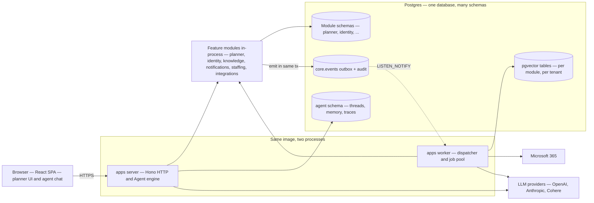
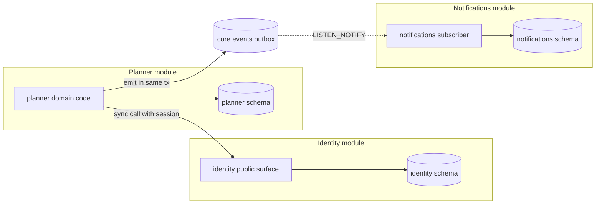
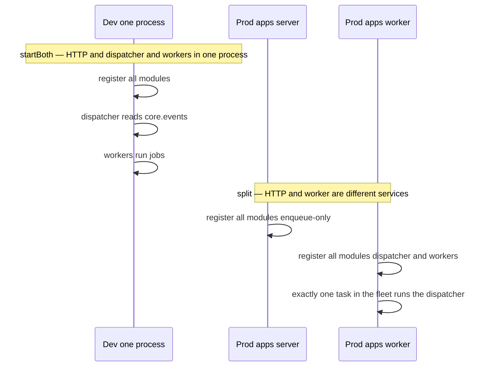
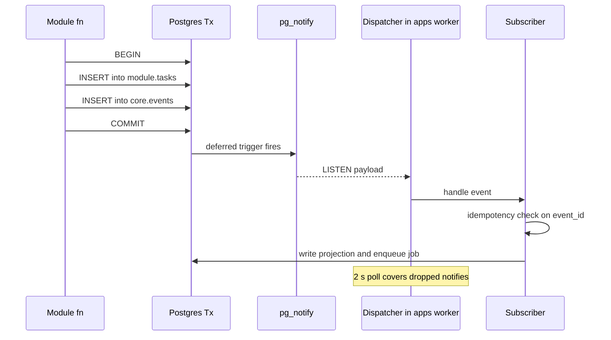
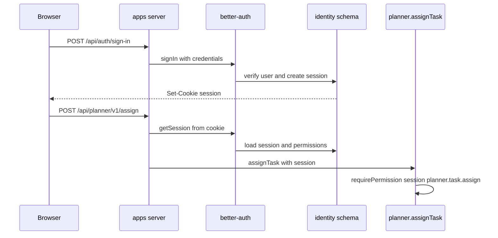
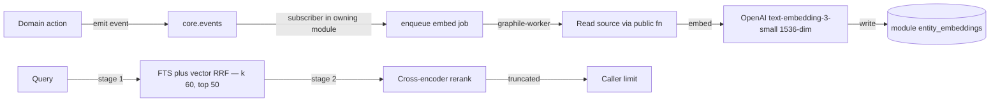
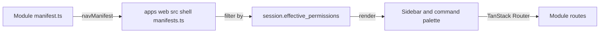
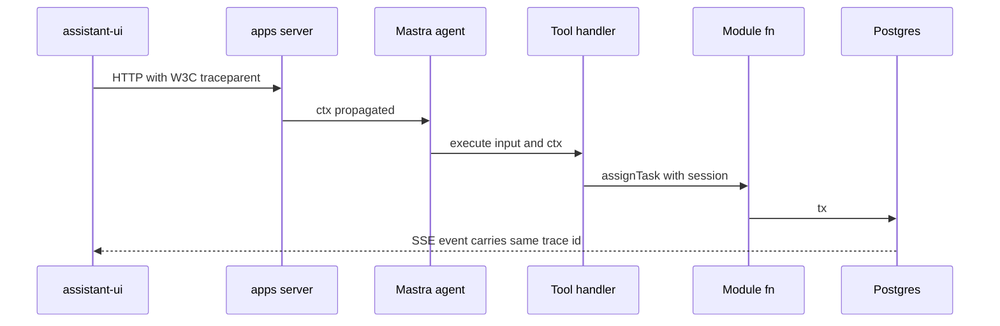

# Architecture

Seta is a multi-tenant, AI-first work-management platform implemented as a modular monolith. A single Postgres database, a single composition library, and multiple Node runtimes share one image; each module owns a Postgres schema, a public TypeScript surface, and an optional set of agent tools that the agent engine composes into Mastra agents at boot.

This document is the single source of truth for the implementation shape. When the code and this document disagree, the document is treated as the bug — the code is corrected to match.

**Related documents.** [`tech-stack.md`](./tech-stack.md) records why each dependency was chosen. [`agent-architecture.md`](./agent-architecture.md) covers the agent system in depth. [`creating-modules.md`](./creating-modules.md) is the module-author guide. [`hosting/aws.md`](./hosting/aws.md) covers production deployment.

---

## System overview



The picture compresses every architectural commitment that follows:

| Element | Significance |
|---|---|
| **One image, two processes** | `apps/server` and `apps/worker` compose the same modules; the runtimes differ only in which subsystems they activate. |
| **Modules in-process** | Cross-module calls are typed function calls, not HTTP. The boundary is the schema and the public surface, not the network. |
| **One Postgres, many schemas** | Module data, the event outbox, embedding tables (pgvector), and agent memory all live in the same database. One backup, one failover, one SLO. |
| **Outbox + LISTEN/NOTIFY** | State mutation and event emission share a transaction; the worker dispatcher fans events to subscribers with at-least-once delivery. |
| **Agent inside the server runtime** | The agent engine composes module-owned tools at boot. Read tools execute directly; write tools pause for explicit user approval. |
| **External boundaries** | Only LLM providers and Microsoft 365 are outside the database; everything else is one transactional store. |

Each of these is unpacked in the sections below.

---

## 1. What Seta is — and isn't

| Seta **is** | Seta **is not** |
|---|---|
| A multi-tenant AI-first work-management platform | A single-tenant internal tool |
| A modular monolith — many modules, one DB, one image | A microservices fleet over HTTP |
| Postgres-everything (events, sessions, vectors, queue) | Multi-store (no Redis, Kafka, separate vector DB) |
| Self-hostable on a single VM or AWS ECS | SaaS-only |
| Agent-callable on every domain action | A chatbot bolted onto CRUD |
| Human-in-the-loop on every write | Auto-approve / fully autonomous |

---

## 2. Design principles

| # | Principle | Why it matters |
|---|---|---|
| 1 | **Schemas are the boundary, not networks** | Module isolation is a refactor pressure, not a deployment cost |
| 2 | **One Postgres, many schemas** | One backup, one failover, one SLO — domains isolated by schema |
| 3 | **RBAC re-checked at the callee** | The caller's claim is never trusted; the bus does not impersonate |
| 4 | **The bus is the outbox** | Lost and phantom events are impossible at the schema |
| 5 | **HITL on every write tool** | An agent never mutates without an approving human |
| 6 | **No internal contract versioning** | Event types, signatures, and unions change in place — no V1/V2 |
| 7 | **Production-grade only** | "Patch now, real fix later" is rejected on review |
| 8 | **Composition at boot, validation at boot** | Typos fail boot, not runtime |

---

## 3. Scale & latency targets

The shape below is calibrated for this envelope. Outside it, the trade-offs in §17 start to bite.

| Dimension | Target | Where to look |
|---|---|---|
| Tenants per cluster | ~5,000 | per-tenant LIST-partitioned vector + per-tenant RBAC |
| Users per tenant | ~10,000 | session-scoped permission cache |
| HTTP p95 (warm) | < 150 ms | Hono + Drizzle + module sub-app |
| Agent first token (p95) | < 1.5 s | supervisor route + warm Mastra agent |
| Event dispatcher lag (p95) | < 200 ms | `LISTEN/NOTIFY` + 2 s poll fallback |
| Retrieval p95 (top-50 + rerank) | < 250 ms | HNSW partition prune + Cohere rerank |
| Cold start (ECS task) | < 45 s | minimum-task autoscaling keeps it off the hot path |

---

## 4. Stack

| Layer | Choice | Section |
|---|---|---|
| Runtime | Node 24 LTS | [tech-stack §1](./tech-stack.md#1-node-24-lts) |
| Build | Turborepo + pnpm, Vite (web), `tsc` (backend) | [§2](./tech-stack.md#2-turborepo--pnpm) |
| HTTP | Hono | [§3](./tech-stack.md#3-hono) |
| Jobs | graphile-worker | [§4](./tech-stack.md#4-graphile-worker) |
| Auth | better-auth + argon2id | [§5](./tech-stack.md#5-better-auth--argon2id) |
| Database | Postgres 17 + pgvector | [§6](./tech-stack.md#6-postgres-17), [§7](./tech-stack.md#7-pgvector) |
| ORM | Drizzle | [§8](./tech-stack.md#8-drizzle-orm) |
| Event bus | Transactional outbox + `LISTEN/NOTIFY` | [§9](./tech-stack.md#9-transactional-outbox--listennotify) |
| Agent runtime | Mastra | [§10](./tech-stack.md#10-mastra) |
| AI SDK | Vercel AI SDK v6 | [§11](./tech-stack.md#11-ai-sdk-v6) |
| Chat UI | assistant-ui v0.14 | [§12](./tech-stack.md#12-assistant-ui) |
| Frontend | React 19 + TanStack Router + Query + shadcn/ui + Tailwind 4 | [§14–17](./tech-stack.md#14-react-19) |
| Cloud | AWS ECS Fargate + RDS + S3 + Secrets Manager | [§18](./tech-stack.md#18-aws-ecs-fargate) |
| IaC | OpenTofu | [§19](./tech-stack.md#19-opentofu) |
| Observability | OpenTelemetry + pino + CloudWatch | [§20](./tech-stack.md#20-opentelemetry--pino) |

---

## 5. Repo layout

```
apps/
├── server/   # Hono HTTP (dev also runs dispatcher + worker pool via startBoth)
├── worker/   # graphile-worker pool + LISTEN/NOTIFY dispatcher (production split)
├── cli/      # ops: migrate, seed, embedding backfills
└── web/      # React 19 SPA — shell + per-module UI

packages/
├── core/             # event bus, outbox, registry, runtime composition
├── identity/         # users, sessions, SSO, role grants
├── planner/          # plans, buckets, tasks, M365 sync
├── integrations/     # M365 boot, mail-transport config, MCP clients
├── knowledge/        # tenant knowledge corpus, RAG pipeline
├── notifications/    # in-app + email prefs, SSE hub
├── agent/          # engine-only: Mastra runtime + agent factory
├── staffing/         # orchestrator: cross-module workflows
└── shared-*/         # infra: config, db, rbac, types, ui, crypto, mailer,
                      #        storage, embeddings, retrieval, testing

sdks/
├── agent/   # @seta/agent-sdk — agent-tool contract (pure types)
└── module/    # @seta/module-sdk — frontend nav contract

infra/
├── docker/    # Dockerfile + compose
└── opentofu/  # AWS reference IaC
```

---

## 6. Modules & boundaries

A module owns a Postgres schema, a public TypeScript surface, and the code behind both. Two — and only two — boundary crossings exist. The diagram below shows both, using planner, identity, and notifications as concrete examples:



Each module reaches its own schema directly. Crossing into another module's domain happens through one of two legal paths only:

| Crossing | What's allowed | What's not |
|---|---|---|
| Synchronous call (planner → identity above) | Import the callee's public surface; pass `session`; the callee re-validates the permission | Importing from another module's `backend/` paths; reading the callee's tables directly |
| Asynchronous event (planner → bus → notifications above) | Emit inside the source-mutation transaction; subscriber consumes idempotently keyed on event ID | Writing into another module's schema; emitting outside the transaction |

Any edge not drawn above is rejected by static analysis — every PR runs CI gates that reject cross-module internal imports, raw SQL crossing schema boundaries, styling outside `@seta/shared-ui`, and cross-schema reads at Drizzle codegen time. The boundary is verified by tooling, not by review discipline.

**No cross-schema foreign keys.** `planner.tasks.assignee_id` is a `uuid` with no FK to `identity.user.id`. Consistency is event-driven via local read-model projections in the consumer's own schema.

**No cross-module data-handle sharing.** A module never hands its Drizzle client to another module. Mutation crosses only through public-surface function calls or domain events.

### Module classification

Three path layers — enforced by dep-cruiser, no maintained allowlist:

| Layer | Path prefix | Rule |
|---|---|---|
| **infra** | `packages/shared-*`, `sdks/*` | Leaf packages — may not import from feature or orchestrator modules |
| **module** | `packages/<name>/` | Cross-module imports go through the public surface only |
| **runtime** | `apps/*` | Apps don't import each other |

On top of the path layer, each module declares a `"setaTier"` in `package.json` — informational metadata naming its role: **foundation** (`core`, `identity`) depended on by every module; **feature** (`planner`, `integrations`, `knowledge`, `notifications`) domain-owning modules; **orchestrator** (`staffing`) composing multiple feature modules; **engine** (`agent`) composing tools and specs into a Mastra runtime.

---

## 7. Canonical module shape

The module factory (`pnpm gen module`) produces this. Walkthrough in [`creating-modules.md`](./creating-modules.md).

```
packages/<module>/
├── package.json                # exports: ., ./events, ./rbac, ./contracts, ./register
├── drizzle.config.ts           # schemaFilter: ['<module>']
├── drizzle/migrations/         # generated + hand-written .sql siblings
└── src/
    ├── index.ts                # public surface — application-service functions
    ├── events.ts               # event constants + zod payload schemas
    ├── rbac.ts                 # permission constants
    ├── contracts.ts            # browser-safe DTOs + zod schemas
    ├── register.ts             # one reg.module({...}) call
    └── backend/
        ├── domain/             # use-case functions (transaction-script style)
        ├── subscribers/        # event handlers (idempotent on event_id)
        ├── jobs/               # graphile-worker task handlers
        ├── http/               # Hono sub-app + zod request schemas
        ├── stream/             # SSE hub (when fanning events to clients)
        ├── workflows/          # Mastra workflow builders
        ├── agent-tools.ts      # AgentTool[] surfaced to agent
        ├── agent-specs.ts      # AgentSpec[] for orchestrator-style agents
        └── db/
            ├── schema.ts       # Drizzle pgSchema('<module>')
            └── client.ts       # internal — never exported
```

| Path | Public? |
|---|---|
| `src/index.ts` | ✅ |
| `src/events.ts`, `rbac.ts`, `contracts.ts`, `register.ts` | ✅ |
| `src/backend/**`, `src/db/**` | ❌ private |

---

## 8. Runtimes

Three Node runtimes share **one composition library** at `packages/core/src/runtime/`, exported as the private subpath `@seta/core/runtime` (dep-cruiser limits importers to `apps/server`, `apps/worker`, and integration tests).

```ts
// Both apps/server/src/index.ts and apps/worker/src/index.ts do:
const reg = createContributionRegistry();
registerCoreContributions(reg);
registerIdentityContributions(reg);
// ... one register*Contributions call per active module ...

const rt = buildRuntime(env, { reg, pool, ...deps });
```

| Runtime | Role |
|---|---|
| `apps/server` | Hono HTTP. **Prod:** HTTP only with enqueue-only `WorkerHandle`. **Dev** (`NODE_ENV !== 'production'`): `startBoth()` runs HTTP + dispatcher + worker pool in one process. |
| `apps/worker` | graphile-worker pool + `LISTEN/NOTIFY` dispatcher. **Only `apps/worker` runs the dispatcher in production** — exactly one instance across the fleet. |
| `apps/cli` | Ops surface: `migrate`, `seed`, embedding backfills. Never starts the dispatcher (dep-cruiser-enforced). |

### Dev vs prod composition



The browser SPA at `apps/web` shares no Node composition with the others. The same registry concept drives the web shell — each web module exports a typed `navManifest` from `@seta/module-sdk`, registered in `apps/web/src/shell/manifests.ts`.

---

## 9. Contribution registry

Each module's `register.ts` makes one `reg.module({...})` call. The registry validates **at composition time** — collisions throw before the runtime finishes booting.

```ts
reg.module({
  name: 'planner',
  schema,                    // Drizzle pgSchema (name must match)
  migrationsDir,             // absolute path

  events,                    // Record<EventType, ZodSchema>
  rbac,                      // Record<permissionSlug, description>

  subscribers,               // SubscriberDef[]   — idempotent on event_id
  jobs,                      // TaskList          — globally unique names
  routes:    { mountAt: '/api/planner/v1', build },   // optional
  stream:    buildStreamHub,                          // optional

  agentTools,                // AgentTool[]     — composed into agents
  agentSpecs,                // AgentSpec[]       — orchestrator personas
  workflows,                 // WorkflowBuilder[] — Mastra workflows

  errorMapper,               // <ModuleError> → { status, body }
});
```

### Boot-time validation

| Check | Fails on |
|---|---|
| Schema name matches `name` | Mismatch → throw |
| Job names globally unique | Collision across modules |
| Permission slugs unique | Collision across modules |
| Tool IDs unique | Collision across modules |
| Agent spec IDs unique | Collision |
| Workflow IDs unique | Collision |
| Every subscriber's event type has a payload schema | Missing schema in any module's `events` |
| Every `agentSpec.tools[]` ID resolves in the tool catalog | Typo, removed tool |

A typo in a tool reference fails boot, not runtime.

---

## 10. Event bus

The bus is a **transactional outbox** in `core.events` plus `LISTEN/NOTIFY` for wakeups. Two classic bugs die at the schema:

| Bug | Why it's impossible |
|---|---|
| *Lost events* — state committed, publish failed | The event row lives in the same transaction |
| *Phantom events* — publish succeeded, state rolled back | Rollback drops the event row too |

### Lifecycle



There is no separate publish path. `core.emit()` throws outside an `emitContext` — the only legal entry points are `withEmit`, `withCoreEmitContext` (for Mastra workflows), and the subscriber framework. Audit rows live in `core.events` alongside domain events — one unified history.

| Property | Guarantee |
|---|---|
| Delivery | At-least-once |
| Ordering | Per-aggregate only — not global |
| Dedup | Subscriber framework, keyed on `event_id` |
| Replay window | Bounded by `core.events` retention (default 90 days) |
| Dispatcher singleton | `apps/worker` only, exactly one task in the fleet |

---

## 11. Identity & sessions

`@seta/identity` wraps better-auth (local password + Entra OIDC) over `identity.user`, `identity.session`, `identity.account`, `identity.verification` (better-auth's tables) plus a sibling `identity.user_profile` for app-specific fields (skills, availability, working_hours, timezone).

Sessions land in request context via a Hono middleware provided by `@seta/core`. Every public-surface function takes a `session: SessionScope` carrying `tenant_id`, `user_id`, `role_summary` (`{ roles, cross_tenant_read }`), `accessible_group_ids`, and `cross_tenant_read`. There is no flattened permission set and no method on the scope itself. RBAC is enforced by each module's standalone `requirePermission(session, slug, groupId?)` function, which throws that module's own error class (e.g. `PlannerError('FORBIDDEN', ...)`) when the caller lacks the permission.

### Login → permission check



**SSO is admin pre-provisioning only.** No just-in-time provisioning. First SSO login links to an existing pre-provisioned user; unknown subjects are rejected.

---

## 12. Agent system

`@seta/agent` is engine-only. It composes module-owned agent tools and specs into Mastra agents via the contribution registry; it does **not** import any feature or orchestrator module (enforced by dep-cruiser rule `agent-no-feature-imports`). The supervisor / specialist design, HITL contract, memory model, planner walkthrough, and code locations are in [`agent-architecture.md`](./agent-architecture.md).

---

## 13. Embeddings & retrieval

Embeddings live in the **owning module's schema** as sibling tables, never in `agent`.



| Stage | What runs |
|---|---|
| Storage | `LIST`-partitioned by `tenant_id`, per-partition HNSW on `halfvec(1536)` (pgvector ≥ 0.7) |
| Stage 1 | FTS + vector RRF (`k = 60`), top-50 |
| Stage 2 | Cross-encoder rerank — Cohere by default, LLM-as-judge fallback, `none` to opt out |
| Provider abstraction | `@seta/shared-embeddings` (`embedMany`, source-hash, model providers) + `@seta/shared-retrieval` (`Retriever`, RRF SQL builder, rerank) |
| Mastra surface used | `@mastra/rag` for `MDocument.chunk()` and `rerank()` only. `@mastra/pg`'s `PgVector` is the per-module vector store — each module instantiates it pointed at its own schema (e.g. `identity_rag`, `knowledge_rag`). |

Backfill of an entity's embeddings is a `apps/cli` one-off command, scoped to a tenant.

---

## 14. Frontend shell

`apps/web` is a React 19 SPA on TanStack Router. The shell at `apps/web/src/shell/` owns providers (session, theme, hotkeys, toasts), the global command palette, and the nav manifest registry.



```ts
// apps/web/src/modules/planner/manifest.ts
export const plannerNavManifest: NavManifest = {
  id: 'planner',
  label: 'Planner',
  icon: Squares2x2,
  requiredPermissions: [],
  useNavExtensions: noNavExtensions,
  nav: [
    { id: 'planner.boards', icon: LayoutDashboard, label: 'Boards', to: '/planner' },
    // ...
  ],
};
```

**Console aggregation.** Tenant-admin UI (users, SSO, audit, integrations, notification prefs, tenant settings) lives in `apps/web/src/modules/admin/` — one admin home, not one admin sub-app per module.

**Style monopoly.** All styling lives in `@seta/shared-ui`; modules compose primitives from there and never introduce their own CSS, Tailwind configuration, or design tokens. This is enforced statically at lint time.

---

## 15. Deployment

The production target is AWS ECS Fargate (HTTP service + dispatcher/worker service), RDS Postgres Multi-AZ with pgvector, S3 + CloudFront for the web bundle, Secrets Manager for environment secrets. A single multi-stage Dockerfile produces both `platform-server` and `platform-web` images; the same image runs self-hosted via `docker compose`. Mode-selectable runtime via `PLATFORM_MODULES` supports per-module deployment. Full topology, sizing, hardening, observability, runbooks, and FinOps in [`hosting/aws.md`](./hosting/aws.md); single-VM self-host in [`hosting/docker-compose.md`](./hosting/docker-compose.md).

Full topology, sizing, security, runbooks, FinOps: [`hosting/aws.md`](./hosting/aws.md).

---

## 16. Observability

| Signal | Stack |
|---|---|
| Traces, metrics | OpenTelemetry — OTLP HTTP exporter, pluggable collector |
| Logs | `pino`, child loggers per subsystem |
| Audit | `core.events` — same table as domain events |
| Health | `/health/live`, `/health/ready`, `/health/startup` on `apps/server`; readiness reports dispatcher backlog and per-subscriber lag |

### Trace propagation



---

## 17. Accepted trade-offs

The architecture imposes the following constraints. Each is a deliberate exchange against a competing design.

| Trade-off | Rationale | Revisit condition |
|---|---|---|
| Modular monolith — modules cannot scale independently below the `PLATFORM_MODULES` split | A single image, backup, and SLO is materially cheaper to operate than N services within the target scale envelope | Sustained writer CPU exceeds 70 % at `db.r6g.16xlarge` with the highest-load module already isolated |
| Single database — schema migrations require coordination across modules | Cross-schema invariants remain enforceable and one backup/restore covers the entire system | A module's migration cadence diverges from the rest by more than an order of magnitude |
| At-least-once event delivery — subscribers must be idempotent | Exactly-once semantics are unattainable across distributed systems without latency or coordination cost the workload does not justify | A use case requires exactly-once semantics that idempotency keys cannot satisfy |
| Per-aggregate event ordering only — no global order | Global ordering imposes a throughput ceiling incompatible with the target tenant density | A use case requires global ordering and cannot be reformulated to shard differently |
| pgvector — not the highest-throughput vector store at extreme scale | Co-location with source data eliminates a vendor and a transactional boundary | Single-tenant vector counts exceed 50 M with rerank latency under sustained pressure |
| Human-in-the-loop required on every write tool — adds a confirmation step | Trust and auditability are prioritised over agent autonomy at the target market | A trusted workflow requires auto-approval (implemented as an explicit, audited opt-in) |
| No microservices — modules cannot be deployed independently | Boundaries are enforced at the schema, not the network | Independent deployment cadence becomes the limiting factor on delivery throughput |

---

## 18. FAQ

| Question | Answer |
|---|---|
| **Why a modular monolith rather than microservices?** | Microservices provide independent deploy at the cost of HTTP between every domain. Schema-level isolation enforced by dep-cruiser provides the same boundary guarantees without the inter-service network surface. The `PLATFORM_MODULES` environment variable supports splitting modules across services when scaling pressure justifies it. |
| **Why Postgres for the event bus rather than Kafka or SQS?** | An external broker cannot participate in the source-of-truth transaction. The outbox-in-Postgres pattern eliminates lost-event and phantom-event failure modes by construction. The throughput ceiling of the chosen approach exceeds the system's scale targets. |
| **Is Prisma supported as an alternative to Drizzle?** | No. Drizzle's `pgSchema('<name>')` plus `schemaFilter` directives are central to module boundary enforcement; Prisma does not model schema-scoped clients at parity. |
| **Is MongoDB supported?** | No. The system depends on `LISTEN/NOTIFY`, deferred-constraint triggers, table partitioning, and pgvector — all Postgres-specific capabilities. |
| **Can the AI SDK v6 substitute for Mastra?** | No. AI SDK v6 provides the LLM client and tool-call protocol; Mastra provides agent composition, memory, and workflow primitives. The two are complementary. |
| **How are agents added independently of modules?** | Agents are not module-independent. Tools are owned by modules; cross-module agents are composed in orchestrator-tier packages (for example, `staffing`). |
| **What is the scale ceiling?** | The targets in §3 describe the validated envelope. Above this, the trade-offs in §17 begin to apply; mitigation involves the `PLATFORM_MODULES` split, read replicas, and isolating the highest-load module onto a dedicated database. |
| **Is the supervisor / specialist pattern documented separately?** | Yes — see [`agent-architecture.md`](./agent-architecture.md). |

---

## 19. Reading code

The fastest path to understanding any subsystem:

| Subsystem | File |
|---|---|
| Registry type + validation | `packages/core/src/composition/registry.ts` |
| `buildRuntime`, `startBoth` | `packages/core/src/runtime/bootstrap.ts` |
| Outbox + dispatcher | `packages/core/src/events/*` |
| Reference feature module | `packages/planner/` |
| Reference orchestrator | `packages/staffing/` |
| Composition in practice | `apps/server/src/index.ts` + `apps/worker/src/index.ts` |
| Agent-tool contract | `sdks/agent/src/index.ts` |
| Frontend nav contract | `sdks/module/src/index.ts` |

For Mastra internals (when wiring the agent engine), consult the Mastra source checkout at `../mastra/` instead of inferring from npm types.

---

## See also

- [`tech-stack.md`](./tech-stack.md) — why each library is here.
- [`agent-architecture.md`](./agent-architecture.md) — the agent system in depth via a planner walkthrough.
- [`creating-modules.md`](./creating-modules.md) — add a module + agent tool + UI.
- [`dev-quickstart.md`](./dev-quickstart.md) — first tenant on a fresh DB.
- [`hosting/aws.md`](./hosting/aws.md) — production deployment.
