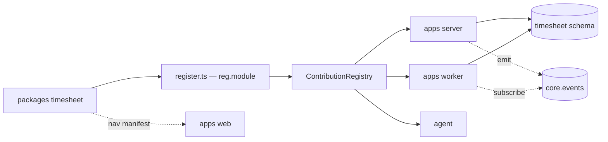
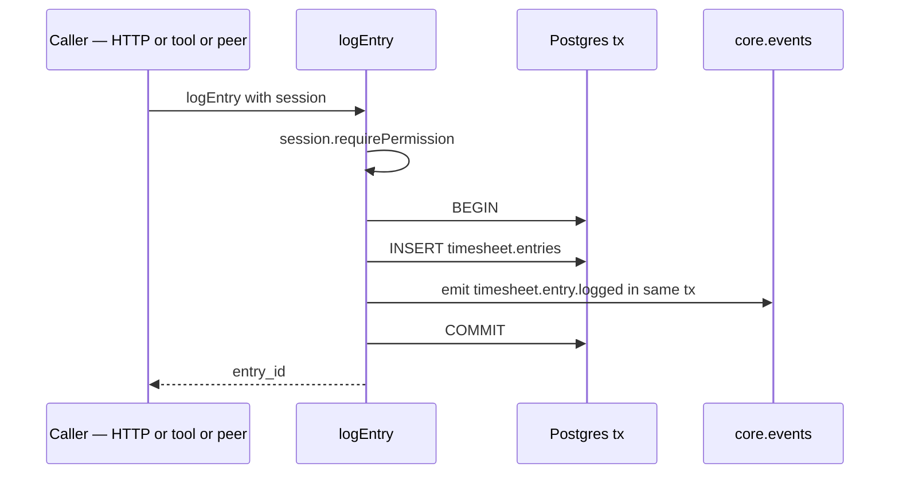

# Creating a module

This guide walks an engineer from `pnpm gen module` to a working, agent-callable module with a user-facing web surface. The running example is a `timesheet` module — small enough to follow end to end, complete enough to exercise every architectural boundary.

The guide is structured so that contributors can pick the depth that matches the time they have available. Hackathon participants should follow the **fast path** sections; production module authors should follow the full sequence.

If anything below conflicts with [`architecture.md`](./architecture.md) §6 (boundaries) or §7 (canonical shape), the architecture document is authoritative — this guide is the operator's view.

---

## TL;DR — the happy path

Six commands, three files you actually write. This builds a `timesheet` module with one table, one domain function, and one agent tool:

```bash
pnpm gen module                                 # answer: timesheet · feature · Y (web companion)
#  → edit packages/timesheet/src/backend/db/schema.ts        (your tables)
pnpm --filter @seta/timesheet db:generate       # generate the migration
pnpm db:migrate                                 # apply it
#  → edit src/backend/domain/<verb-entity>.ts                (the only way into the module)
#  → edit src/backend/agent-tools/<verb-entity>.ts           (expose it to the agent)
#  → edit src/register.ts                                    (wire schema/events/rbac/tools)
pnpm --filter @seta/timesheet typecheck && pnpm lint
```

The generator scaffolds everything else. Jump to the step you need:

| I want to… | Section |
|---|---|
| Scaffold the package | [§1](#1-scaffold-the-module-fast-path) |
| Define tables + migrate | [§2](#2-define-tables-fast-path) |
| Declare events & permissions | [§3](#3-declare-events-and-permissions-full-path-events-optional-for-fast-path) |
| Write the domain function | [§4](#4-implement-the-public-surface-fast-path) |
| Expose it as an agent tool | [§5](#5-expose-the-function-as-an-agent-tool-fast-path) |
| Register everything | [§6](#6-register-the-module-fast-path) |
| Add a web UI | [§7](#7-web-companion--ui-walkthrough-standard-path) |
| Add an agent specialist | [§8](#8-agent-ux-considerations-standard-path) |
| Write tests | [§9](#9-tests-full-path) |
| Pre-PR checklist | [§10](#10-pre-pr-checklist-all-paths) |

---

## 0. Pick your path

| Path | Time | Includes | Skip |
|---|---|---|---|
| **Fast path** | ~30 min | Scaffold, one domain function, one read-only agent tool | UI, events, jobs, subscribers, write tools |
| **Standard path** | ~2 hr | Fast path + HTTP route + web nav manifest + one list screen | Events, jobs, subscribers, agent specialist |
| **Full path** | ~1 day | Standard path + events, subscribers, jobs, SSE, write tool with HITL, integration tests | (nothing) |

Sections below are tagged with the path they belong to; untagged sections are required for every path.

### How a module plugs into the runtime



What a module contributes through one `reg.module({...})` call:

| Contribution | Consumed by |
|---|---|
| `schema` + `migrationsDir` | Migration runner; Drizzle codegen |
| `events` (zod payload schemas) | Bus, audit, subscribers in peer modules |
| `rbac` (permission slugs) | Identity, session-scope checks, tool RBAC filter |
| `agentTools` | Agent tool catalogue |
| `routes` (optional) | `apps/server` HTTP mount |
| `subscribers`, `jobs`, `workflows` (optional) | `apps/worker` dispatcher + pool |
| `stream` (optional) | SSE hub, consumed by web companion |
| `navManifest` (web companion) | `apps/web` shell |

---

## 1. Scaffold the module (fast path)

```bash
pnpm gen module
```

The generator asks three questions:

| Prompt | Answer for this guide |
|---|---|
| Module name (kebab-case) | `timesheet` |
| Tier | `feature` (default) |
| Generate `apps/web/src/modules/<name>/` companion folder? | `Y` |

### What the generator produces

The generator creates `packages/timesheet/` populated with the canonical module shape: public surface stubs (`index.ts`, `events.ts`, `rbac.ts`, `contracts.ts`, `register.ts`), backend layout (`db/`, `domain/`, `subscribers/`, `jobs/`, `http/`, `agent-tools.ts`), an initial Drizzle migration that creates the `timesheet` schema, and a `tests/public/loads.test.ts` smoke test.

### Side effects of generation

| File | Change |
|---|---|
| `apps/server/src/index.ts`, `apps/worker/src/index.ts` | `import { registerTimesheetContributions } from '@seta/timesheet/register'` + a registration call |
| `apps/server/package.json`, `apps/worker/package.json` | `"@seta/timesheet": "workspace:^"` added |
| `apps/web/src/modules/timesheet/` | Created with a `navManifest` stub (only if web companion answered `Y`) |
| `apps/web/src/shell/manifests.ts` | Manifest registered |
| Lock file | `pnpm install` re-runs automatically |

### Verify the scaffold

```bash
pnpm --filter @seta/timesheet typecheck
pnpm --filter @seta/timesheet test
pnpm lint
```

| Command | Expected result |
|---|---|
| `typecheck` | Exits 0 |
| `test` | `1 passed (loads.test.ts)` |
| `lint` | dep-cruiser passes |

If any of the three fails immediately after scaffolding, the generator is the bug — open an issue rather than editing around it.

> **Hackathon fast path.** A working module exists at this point. Subsequent sections add capability; nothing requires changes to scaffold output.

---

## 2. Define tables (fast path)

Edit `packages/timesheet/src/backend/db/schema.ts`:

```ts
import { pgSchema, uuid, text, timestamp } from 'drizzle-orm/pg-core';

export const timesheetSchema = pgSchema('timesheet');

export const entries = timesheetSchema.table('entries', {
  id: uuid('id').primaryKey(),
  tenant_id: uuid('tenant_id').notNull(),
  user_id: uuid('user_id').notNull(),                  // no cross-schema FK
  hours: text('hours').notNull(),
  occurred_on: timestamp('occurred_on', { withTimezone: true }).notNull(),
});
```

Generate and apply the migration:

```bash
pnpm --filter @seta/timesheet db:generate
pnpm db:migrate
```

| Action | Expected output |
|---|---|
| `db:generate` | A new file under `packages/timesheet/drizzle/migrations/` |
| `db:migrate` | "Applied N migration(s)" — the new file in N |

| Rule | Why |
|---|---|
| No foreign key to other modules' tables | Cross-schema FKs are prohibited (architecture §6); consistency arrives via events |
| Never hand-edit files under `drizzle/` | The generator is the source of truth; edit `schema.ts` and regenerate |
| For SQL Drizzle cannot model (partitioning, deferred triggers, `pg_notify` wiring) | Hand-written `.sql` files coexist alongside generated ones; first line must comment the limitation |

---

## 3. Declare events and permissions (full path; events optional for fast path)

`packages/timesheet/src/events.ts`:

```ts
import { z } from 'zod';

export const TIMESHEET_ENTRY_LOGGED = 'timesheet.entry.logged' as const;

export const TIMESHEET_ENTRY_LOGGED_PAYLOAD = z.object({
  entry_id: z.string().uuid(),
  user_id: z.string().uuid(),
  hours: z.string(),
});

export const TIMESHEET_EVENTS = {
  [TIMESHEET_ENTRY_LOGGED]: TIMESHEET_ENTRY_LOGGED_PAYLOAD,
} as const;
```

`packages/timesheet/src/rbac.ts`:

```ts
export const TIMESHEET_ENTRY_WRITE = 'timesheet.entry.write' as const;
export const TIMESHEET_ENTRY_READ = 'timesheet.entry.read' as const;

export const TIMESHEET_PERMISSIONS = {
  [TIMESHEET_ENTRY_WRITE]: 'Log timesheet entries',
  [TIMESHEET_ENTRY_READ]: 'Read timesheet entries',
} as const;
```

### Naming rules

| Subject | Format | Example |
|---|---|---|
| Event type | `<module>.<entity>.<verb-past-tense>` | `timesheet.entry.logged` |
| Permission slug | `<module>.<entity>.<verb>` | `timesheet.entry.write` |
| Tool ID (next section) | `<module>_<verb><Entity>` (camelCase verb, PascalCase entity) | `timesheet_logEntry` |

The contribution registry validates uniqueness across all modules at boot. Collisions throw before the server accepts requests.

---

## 4. Implement the public surface (fast path)

Domain functions live in `packages/timesheet/src/backend/domain/`. They are the only code paths into the module; every consumer — HTTP, agent tool, subscriber, peer module — passes through them.

`packages/timesheet/src/backend/domain/log-entry.ts`:

```ts
export interface LogEntryInput {
  hours: string;
  occurred_on: Date;
  session: SessionScope;
}

export async function logEntry(input: LogEntryInput): Promise<{ entry_id: string }> {
  input.session.requirePermission(TIMESHEET_ENTRY_WRITE);
  return withEmit(input.session, async () => {
    const id = crypto.randomUUID();
    await timesheetDb().insert(entries).values({
      id,
      tenant_id: input.session.tenant_id,
      user_id: input.session.user_id,
      hours: input.hours,
      occurred_on: input.occurred_on,
    });
    await emit({
      event_type: TIMESHEET_ENTRY_LOGGED,
      aggregate_type: 'timesheet.entry',
      aggregate_id: id,
      tenant_id: input.session.tenant_id,
      payload: { entry_id: id, user_id: input.session.user_id, hours: input.hours },
    });
    return { entry_id: id };
  });
}
```

Re-export from `src/index.ts`: `export { logEntry, type LogEntryInput } from './backend/domain/log-entry.ts';`

### Domain function structure



| Rule | Enforced by |
|---|---|
| Every public function takes `session: SessionScope` | Type system; permission re-check |
| State change and event emission share one transaction | `withEmit(session, async () => ...)` |
| Peer modules import this function via `@seta/timesheet` | dep-cruiser |
| Peer modules never import from `src/backend/` | dep-cruiser |

---

## 5. Expose the function as an agent tool (fast path)

Agent tools live in `src/backend/agent-tools/<verb-entity>.ts` and are aggregated in `agent-tools.ts`.

`packages/timesheet/src/backend/agent-tools/log-entry.ts`:

```ts
export const timesheetLogEntryTool = defineAgentTool({
  id: 'timesheet_logEntry',
  name: 'Log Timesheet Entry',
  description: 'Log a timesheet entry for the current user. Hours are decimal (for example "1.5").',
  input: z.object({
    hours: z.string().describe('Decimal hours worked, e.g. "1.5"'),
    occurredOn: z.string().datetime().describe('ISO-8601 timestamp of when the work was performed'),
  }),
  output: z.object({ entryId: z.string().uuid() }),
  rbac: TIMESHEET_ENTRY_WRITE,
  needsApproval: true,
  execute: async (input, ctx) => {
    const session = await buildActorSession(actorFromContext(ctx));
    const { entry_id } = await logEntry({
      hours: input.hours,
      occurred_on: new Date(input.occurredOn),
      session,
    });
    return { entryId: entry_id };
  },
});
```

Aggregate in `agent-tools.ts`: `export const timesheetAgentTools: AgentTool[] = [timesheetLogEntryTool];`

### Tool description grammar

The LLM reads tool descriptions to decide which tool to call. Poor descriptions cause poor selection.

| Element | Pattern | Example |
|---|---|---|
| Imperative verb | First word names the action | "Log...", "List...", "Search...", "Assign..." |
| Object | Names the entity affected | "...a timesheet entry..." |
| Scope | Names whose data is touched | "...for the current user." |
| Constraint | Inline constraint, not in input | "Hours are decimal." |

| Avoid | Why |
|---|---|
| "This tool is used to..." | Wastes tokens; restates obvious framing |
| "Returns..." | Output is in `output` schema, not description |
| "Internal helper for..." | Tools are user-facing; never describe internals |
| Field metadata in description | Use `.describe()` on the schema field |

| Rule | Enforced by |
|---|---|
| Import from `@seta/agent-sdk`, never `@seta/agent` internals | dep-cruiser (`agent-no-feature-imports`) |
| Use `defineAgentTool`, not `createTool` from `@mastra/core/tools` | SDK wrapper attaches RBAC and approval flag |
| Set `needsApproval: true` on every write tool | Convention; reviewed at PR time |
| Resolve session via `actorFromContext` + `buildActorSession` | Identity is never trusted from input |

### Tool execution timeout & cancellation

Every tool authored via `defineAgentTool` is automatically wrapped with:

| Behaviour | Default | Override |
|---|---|---|
| Read-tool deadline | 30 s | `AGENT_TOOL_TIMEOUT_READ_MS` |
| Write-tool deadline (`needsApproval: true`) | 60 s | `AGENT_TOOL_TIMEOUT_WRITE_MS` |
| Per-tool override (capped by `AGENT_TOOL_TIMEOUT_MAX_MS`, default 300 s) | — | `executionTimeoutMs` on the spec |
| Circuit breaker | 3 consecutive failures → open 60 s | `AGENT_TOOL_BREAKER_*` |

When the deadline passes, the wrapper aborts a composed `AbortSignal` that
is exposed to your tool via `ctx.abortSignal`. The agent receives a
structured `tool_execution_timeout` error.

**You MUST forward `ctx.abortSignal` into every I/O call inside `execute`:**

```ts
defineAgentTool({
  id: 'knowledge.semanticSearch',
  // ...
  execute: async ({ query }, ctx) => {
    // fetch honours the signal — connection is released on abort
    const res = await fetch(`/embed?q=${encodeURIComponent(query)}`, {
      signal: ctx.abortSignal,
    });
    // pg helpers that accept a signal will cancel the in-flight query
    return retriever.search({ query }, { signal: ctx.abortSignal });
  },
});
```

A tool that ignores `ctx.abortSignal` will still time out from the agent's
perspective — but resources held by the tool (DB connections, in-flight
HTTP) leak until upstream gives up on its own. Always forward the signal.

For tools that genuinely need longer than 60 s, set
`executionTimeoutMs: 120_000` on the spec. For multi-minute work, refactor
into a workflow instead — workflows have first-class suspend / resume and
do not block an agent turn.

The breaker is per-`(tenant, tool)`; one noisy tenant cannot starve another.
When it opens, the engine emits a `agent.tool.breaker_opened` event
through the existing outbox (no new tables, no migration).

---

## 6. Register the module (fast path)

`packages/timesheet/src/register.ts`:

```ts
export function registerTimesheetContributions(reg: ContributionRegistry): void {
  reg.module({
    name: 'timesheet',
    schema,
    migrationsDir: resolve(__dirname, '../drizzle/migrations'),
    events: TIMESHEET_EVENTS,
    rbac: TIMESHEET_PERMISSIONS,
    agentTools: timesheetAgentTools,
  });
}
```

Add `subscribers`, `jobs`, `routes`, `stream`, `agentSpecs`, `workflows`, or `errorMapper` to `reg.module({...})` as the module gains the corresponding capability. The contribution registry validates uniqueness of names, slugs, tool IDs, and workflow IDs at boot — collisions fail boot, not runtime.

---

## 7. Web companion — UI walkthrough (standard path)

The generator produced `apps/web/src/modules/timesheet/` with the structure below. This section adds a list screen and a create dialog, both backed by the module's domain function.

### Folder layout

```
apps/web/src/modules/timesheet/
├── manifest.ts              # NavManifest registered in apps/web/src/shell/manifests.ts
├── api/
│   └── timesheet-client.ts  # typed Hono RPC client + DTO re-exports
├── state/
│   └── query-keys.ts        # centralised TanStack Query key factory
├── pages/
│   └── entries-page.tsx     # list + create UI
└── components/
    └── log-entry-dialog.tsx # create dialog
```

### Step 1 — HTTP route

Web calls the backend through a Hono sub-app under `packages/timesheet/src/backend/http/`. The route validates input with `zValidator`, resolves the session from request context, and delegates to `logEntry`:

```ts
export function buildTimesheetRoutes() {
  return new Hono().post(
    '/entries',
    zValidator('json', z.object({ hours: z.string(), occurredOn: z.string().datetime() })),
    async (c) => {
      const result = await logEntry({
        ...c.req.valid('json'),
        occurred_on: new Date(c.req.valid('json').occurredOn),
        session: getSessionScope(c),
      });
      return c.json(result, 201);
    },
  );
}
```

Wire it in `register.ts`: `routes: { mountAt: '/api/timesheet/v1', build: buildTimesheetRoutes }`.

### Step 2 — Typed client and centralised query keys

Hono RPC infers a typed client from the route definition; the client breaks at compile time when the route signature changes. Alongside it, centralise TanStack Query keys per module so cache invalidation has a single source of truth (planner convention in `apps/web/src/modules/planner/state/query-keys.ts`).

```ts
// api/timesheet-client.ts
export const timesheetClient = hc<ReturnType<typeof buildTimesheetRoutes>>(
  '/api/timesheet/v1',
  { fetch: (i, init) => fetch(i, { ...init, credentials: 'include' }) },
);

// state/query-keys.ts
export const timesheetKeys = {
  all: ['timesheet'] as const,
  entries: () => [...timesheetKeys.all, 'entries'] as const,
  entriesFor: (userId: string) => [...timesheetKeys.entries(), userId] as const,
};
```

### Step 3 — Nav manifest

The shell filters items by `session.effective_permissions` before rendering — users without `timesheet.entry.read` do not see the nav entry.

```ts
export const timesheetNavManifest: NavManifest = {
  id: 'timesheet',
  label: 'Timesheet',
  icon: Clock,
  requiredPermissions: [TIMESHEET_ENTRY_READ],
  nav: [{
    label: 'Work',
    items: [{ id: 'timesheet.entries', icon: Clock, label: 'My entries', to: '/timesheet' }],
  }],
};
```

### Step 4 — List screen

The page uses TanStack Query against the typed client; `shared-ui` provides Card, Button, DataTable.

```tsx
export function EntriesPage() {
  const session = useSession();
  const [open, setOpen] = useState(false);
  const { data, isLoading } = useQuery({
    queryKey: timesheetKeys.entriesFor(session.user_id),
    queryFn: async () => (await timesheetClient.entries.$get()).json(),
  });
  return (
    <Card>
      <Card.Header title="My timesheet" actions={<Button onClick={() => setOpen(true)}>Log entry</Button>} />
      <DataTable loading={isLoading} rows={data ?? []}
        columns={[{ key: 'occurred_on', label: 'Date' }, { key: 'hours', label: 'Hours' }]} />
      <LogEntryDialog open={open} onClose={() => setOpen(false)} />
    </Card>
  );
}
```

### Step 5 — Create dialog with optimistic invalidation

The dialog mutation posts to the typed client and invalidates the entries cache on success:

```tsx
export function LogEntryDialog({ open, onClose }: { open: boolean; onClose: () => void }) {
  const qc = useQueryClient();
  const mutation = useMutation({
    mutationFn: async (input: { hours: string; occurredOn: string }) => {
      const res = await timesheetClient.entries.$post({ json: input });
      if (!res.ok) throw new Error(`HTTP ${res.status}`);
      return res.json();
    },
    onSuccess: () => qc.invalidateQueries({ queryKey: timesheetKeys.entries() }),
  });
  return (
    <Dialog open={open} onClose={onClose} title="Log entry">
      <Form onSubmit={(v) => mutation.mutate(v, { onSuccess: onClose })}
            defaultValues={{ hours: '', occurredOn: new Date().toISOString() }}>
        <FormField name="hours" label="Hours" placeholder="1.5" required />
        <FormField name="occurredOn" label="Date" type="datetime-local" required />
        <Dialog.Actions>
          <Button variant="ghost" onClick={onClose}>Cancel</Button>
          <Button type="submit" loading={mutation.isPending}>Save</Button>
        </Dialog.Actions>
      </Form>
    </Dialog>
  );
}
```

### Style discipline

All styling lives in `@seta/shared-ui`. No `.css`, `tailwind.config.*`, or `@theme/@layer/@apply` outside that package — enforced by `pnpm lint:styles`. The single allowed shim is `apps/web/src/styles/globals.css`. Compose `shared-ui` primitives; do not introduce new utility classes in the module.

### SSE consumption (full path)

If the module fans events to clients, register a stream hub on `reg.module({ stream })` and consume it from the page:

```tsx
import { useStream } from '@/shell/sse';
import { timesheetKeys } from '../state/query-keys';

useStream('/api/timesheet/v1/stream', (event) => {
  if (event.type === 'timesheet.entry.logged') {
    qc.invalidateQueries({ queryKey: timesheetKeys.entries() });
  }
});
```

See `apps/web/src/modules/planner/` for a reference implementation including reconnection, version reconciliation, and event-driven cache updates.

---

## 8. Agent UX considerations (standard path)

### When to declare an `AgentSpec`

Most feature modules do not need their own specialist. The supervisor selects tools by description; a well-described tool is reachable from the supervisor without a domain-scoped specialist. Declare a specialist when the module exposes four or more tools that compose in sequence, when the tools require a non-trivial system prompt, or — for tools that span multiple modules — in an orchestrator module such as `staffing` rather than the feature module itself.

### Tool count budget

| Tool count | Action |
|---|---|
| 1–10 per specialist | Optimal |
| 11–15 per specialist | Acceptable; review tool descriptions for clarity |
| 16+ per specialist | Split into two specialists; LLM tool selection degrades past this point |

### Input schema patterns

| Pattern | Apply |
|---|---|
| `.describe('...')` on every field | LLMs read these to assemble arguments |
| `z.string().uuid()` for IDs, never `z.string()` | The schema enforces validity at the tool boundary |
| `z.string().datetime()` for timestamps | ISO-8601 in, parsed to `Date` in the adapter |
| `z.enum([...])` for fixed sets | LLM cannot supply out-of-range values |
| Optional fields explicitly `.optional()` | The schema is the contract; do not rely on convention |

### Local agent testing

```bash
pnpm agent:repl --tool timesheet_logEntry
```

The REPL composes the tool against a fake session and prompts for arguments; responses are streamed as the agent would receive them. Use this to validate descriptions and schemas before opening a PR.

---

## 9. Tests (full path)

Test layers, by directory:

| Directory | Runs | Purpose |
|---|---|---|
| `tests/unit/` | Pure functions, no DB | Domain logic without infrastructure |
| `tests/integration/` | Real Postgres via `testcontainers` | Domain function end-to-end through the schema |
| `tests/public/` | Only `@seta/<module>` imports allowed | Asserts the public surface is sufficient |
| `tests/web/` (in `apps/web`) | Vitest + Testing Library | Component behaviour |
| Playwright in `tests/e2e/` (root) | Real browser | User-visible flows |

Run module tests:

```bash
pnpm --filter @seta/timesheet test
```

Run the full suite locally before opening a PR:

```bash
pnpm typecheck && pnpm lint && pnpm test
pnpm test:e2e   # if the web companion changed
```

| Rule | Why |
|---|---|
| No database mocks | `testcontainers` provisions a real Postgres; mock/prod divergence is a known failure mode |
| Integration tests assert the emitted event row | The bus is the outbox; the event row is part of the contract |
| Public-surface tests import only `@seta/<module>` | CI excludes peer module source paths; private cross-module deps fail |

---

## 10. Pre-PR checklist (all paths)

| Check | Command | Expected |
|---|---|---|
| Types | `pnpm typecheck` | exits 0 |
| Lint, dep-cruiser, raw-SQL, styles | `pnpm lint` | exits 0 |
| Unit + integration tests | `pnpm test` | all green |
| End-to-end tests (if web changed) | `pnpm test:e2e` | all green |
| Boot smoke check | `pnpm --filter @seta/server dev` | server reaches `/health/ready` 200 |

The boundary gate (`pnpm lint`) catches the most common new-module mistakes: cross-module internal imports, accidental imports from `@seta/agent` internals instead of `@seta/agent-sdk`, `shared-*` reaching into a feature module.

---

## Reference

| Subject | File |
|---|---|
| Full `reg.module({...})` shape | [`architecture.md`](./architecture.md) §9 |
| Boundary rules dep-cruiser enforces | [`architecture.md`](./architecture.md) §6 |
| Reference feature module | `packages/planner/` |
| Reference orchestrator module | `packages/staffing/` |
| Tool contract definition | `sdks/agent/src/index.ts` |
| Web nav contract definition | `sdks/module/src/index.ts` |
| Agent system design | [`agent-architecture.md`](./agent-architecture.md) |
