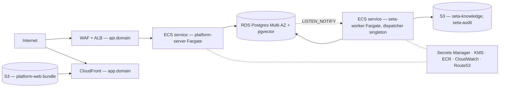
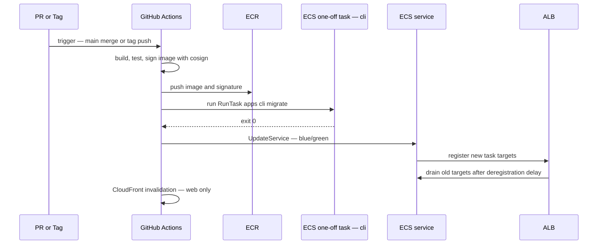

# AWS production deployment

This document describes the production AWS deployment of Seta — topology, sizing, security, observability, runbooks, and cost. It targets operators running Seta in staging and production environments. The supported infrastructure-as-code implementation is the OpenTofu module at `infra/opentofu/aws-ecs/`, which provisions everything described below.

For the underlying architecture, see [`../architecture.md`](../architecture.md). For the rationale behind each AWS service choice, see [`../tech-stack.md`](../tech-stack.md) §18–§20.

---

## Contents

| Section | Subject |
|---|---|
| [1. Audience and assumptions](#1-audience-and-assumptions) | Scope of this document |
| [2. Two-environment model](#2-two-environment-model) | Staging and production accounts, promotion path |
| [3. Reference architecture](#3-reference-architecture) | Full topology diagram |
| [4. Sizing matrix](#4-sizing-matrix) | Instance types and counts per scale tier |
| [5. Network](#5-network) | VPC, subnets, endpoints, PrivateLink |
| [6. Compute](#6-compute) | ECS Fargate services, task definitions, autoscaling |
| [7. Data](#7-data) | RDS, parameter groups, replicas, connection pooling |
| [8. Storage](#8-storage) | S3 buckets, lifecycle, CloudFront |
| [9. Secrets and encryption](#9-secrets-and-encryption) | Secrets Manager, KMS, rotation |
| [10. Identity and access](#10-identity-and-access) | IAM matrix, SG matrix, WAF |
| [11. Observability](#11-observability) | OTEL collector, CloudWatch, SLOs, alerts |
| [12. Deployment pipeline](#12-deployment-pipeline) | Staging on merge, production on tag |
| [13. Runbooks](#13-runbooks) | Rollback, failover, dispatcher, lag, cost, restore |
| [14. FinOps](#14-finops) | Cost model, Savings Plans, guardrails |
| [15. Disaster recovery](#15-disaster-recovery) | RTO, RPO, cross-region |

---

## 1. Audience and assumptions

| Assumption | |
|---|---|
| Two AWS accounts | One for staging, one for production, ideally under an Organisation |
| User scale | Between 50 and 5,000 users across all tenants |
| Compliance posture | SOC 2-equivalent controls or stricter |
| Operator profile | Familiar with AWS console + CLI; comfortable reading OpenTofu HCL |
| Domains | `app.<domain>` and `api.<domain>` for production; `app.staging.<domain>` and `api.staging.<domain>` for staging |

Self-hosters running on a single VM should refer to [`docker-compose.md`](./docker-compose.md) instead.

---

## 2. Two-environment model

| Aspect | Staging | Production |
|---|---|---|
| AWS account | Separate account under the same Organisation | Separate account under the same Organisation |
| Promotion trigger | Merge to `main` | Git tag matching `v*` |
| Image source | ECR (built & pushed by GitHub Actions on each `main` commit) | ECR (built & pushed by GitHub Actions on each tag) |
| Database | RDS Postgres `db.t4g.medium` Multi-AZ | RDS Postgres `db.r6g.large` Multi-AZ or larger (see §4) |
| Tenants | Internal test tenants only | Customer tenants |
| Domains | `*.staging.<domain>` | `*.<domain>` |
| Alarms | Slack-only | Slack + PagerDuty |
| Data retention | 14 days backups | 35 days backups + cross-region copy |

### Promotion path

```mermaid
flowchart LR
    PR[PR opened] -->|CI green| MM[Merge to main]
    MM -->|GitHub Actions build-push| ECRs[Push image to staging ECR]
    ECRs -->|Force new deployment| ECSs[Staging ECS update]
    ECSs -->|Soak 24h, manual approval| Tag[Cut tag v1.x.y]
    Tag -->|GitHub Actions build-push| ECRp[Push image to production ECR]
    ECRp -->|Blue/green| ECSp[Production ECS update]
```



---

## 3. Reference architecture



The single-service layout above is the default.

---

## 4. Sizing matrix

Three scale tiers, calibrated to user counts and request rates.

| Tier | Users | Concurrent agents | RDS instance | RDS storage | ECS server tasks | Server task CPU/mem | ECS worker tasks | Worker task CPU/mem |
|---|---|---|---|---|---|---|---|---|
| **Starter** | < 50 | < 5 | `db.t4g.medium` Multi-AZ | 100 GB gp3 | 2 | 0.5 vCPU / 1 GB | 1 | 1 vCPU / 2 GB |
| **Growth** | 50–500 | 5–50 | `db.r6g.large` Multi-AZ | 250 GB gp3 | 2–4 (autoscale) | 1 vCPU / 2 GB | 1 (singleton dispatcher) | 2 vCPU / 4 GB |
| **Scale** | 500–5,000 | 50–500 | `db.r6g.2xlarge` Multi-AZ + 1 read replica | 1 TB gp3, 12,000 IOPS | 4–12 (autoscale) | 2 vCPU / 4 GB | 1 dispatcher + 1–4 worker pool | 4 vCPU / 8 GB |

| Service | Autoscaling signal | Min | Max | Scale-out cooldown |
|---|---|---|---|---|
| `platform-server` | ALB `RequestCountPerTarget` > 100 OR avg CPU > 70 % | tier min | tier max | 60 s |
| `seta-worker` (dispatcher) | Pinned to **1 task** — never scales | 1 | 1 | n/a |
| `seta-worker` (pool, Scale tier) | Job backlog (`graphile_worker.job_count`) > 100 | 1 | 4 | 120 s |

The dispatcher singleton is critical: more than one running task corrupts `LISTEN/NOTIFY` deduplication. Use ECS `service deploymentConfiguration.maximumPercent: 100` and `minimumHealthyPercent: 0` to ensure rolling updates never produce two active dispatcher tasks.

---

## 5. Network

### VPC layout

```
VPC 10.0.0.0/16
├── us-east-1a
│   ├── public  10.0.0.0/24    ALB, NAT GW
│   ├── private 10.0.10.0/24   ECS tasks
│   └── data    10.0.20.0/24   RDS, ElastiCache (none today)
├── us-east-1b
│   ├── public  10.0.1.0/24    ALB, NAT GW
│   ├── private 10.0.11.0/24   ECS tasks
│   └── data    10.0.21.0/24   RDS standby
└── us-east-1c
    ├── public  10.0.2.0/24
    ├── private 10.0.12.0/24
    └── data    10.0.22.0/24
```

| Subnet tier | Inbound | Outbound | Tenant |
|---|---|---|---|
| `public` | 443 from `0.0.0.0/0` | All | ALB, NAT |
| `private` | From ALB SG only | To `data` SG and to VPC endpoints; egress to internet via NAT for ECR/Secrets only on the Starter tier | ECS tasks |
| `data` | From `private` SG on 5432 | None | RDS |

### VPC endpoints (Growth and Scale tiers)

Add gateway and interface endpoints to avoid NAT egress charges and to reduce blast radius:

| Endpoint | Type | Reason |
|---|---|---|
| `s3` | Gateway | ECR image layer pulls, S3 reads |
| `ecr.api`, `ecr.dkr` | Interface | Image pulls without internet |
| `secretsmanager` | Interface | Secrets without internet |
| `logs` | Interface | CloudWatch Logs |
| `monitoring` | Interface | CloudWatch metrics |
| `sts` | Interface | OIDC role assumption |
| `kms` | Interface | Envelope encryption |

Starter tier uses the NAT gateway in each AZ; Growth and Scale rely on VPC endpoints and may eliminate the NAT entirely (with cost savings — see §14).

---

## 6. Compute

Both runtimes share one container image, distinguished by the entrypoint subcommand. The image runs TypeScript source directly via `tsx` (no `dist/` artifact); `/entrypoint.sh` dispatches on its first positional arg (`serve` | `worker` | `migrate` | `seed` | `health`).

| Service | Image | Command | `PLATFORM_MODULES` | Notes |
|---|---|---|---|---|
| `platform-server` | `platform-server:<tag>` | `/entrypoint.sh serve` | `*` (or comma list for split topology) | HTTP only; enqueue-only worker handle |
| `seta-worker` | `platform-server:<tag>` (same image) | `/entrypoint.sh worker` | `*` | Dispatcher + worker pool |

### Task definition essentials

| Setting | Value |
|---|---|
| `taskRoleArn` | Per-environment role, scoped per §10 |
| `executionRoleArn` | `AmazonECSTaskExecutionRolePolicy` + Secrets Manager read for the per-env secret |
| `stopTimeout` | 60 s for `platform-server`, 120 s for `seta-worker` (job drain) |
| `healthCheck` | `platform-server`: `wget -qO- http://localhost:3000/health/ready` |
| `essential containers` | Single app container; optional OTEL collector sidecar |

### Graceful shutdown

`platform-server` accepts in-flight requests for up to 30 s after SIGTERM, then exits. `seta-worker` drains running jobs for up to 90 s, releases the dispatcher LISTEN connection, then exits. The ALB deregistration delay is set to 30 s (server) and 120 s (worker) to match.

---

## 7. Data

### RDS Postgres configuration

| Parameter | Value | Reason |
|---|---|---|
| Engine | Postgres 17 | pgvector + `LISTEN/NOTIFY` + partitioning |
| Multi-AZ | Yes | RPO ≈ 0, RTO ≤ 60 s on AZ failure |
| Storage | gp3, encrypted with environment-specific KMS CMK | Encryption at rest; IOPS independent of size |
| Performance Insights | Enabled, 7-day retention | Query-level diagnostics |
| Backup retention | 35 days (production); 14 days (staging) | PITR window |
| Backup window | Off-peak (e.g. 04:00–05:00 UTC) | Avoid load contention |
| Deletion protection | On | Prevents accidental deletion in console |

### Parameter group

| Parameter | Value | Reason |
|---|---|---|
| `shared_preload_libraries` | `pg_stat_statements` | Query stats. pgvector is a plain extension (`CREATE EXTENSION`), not preloadable, so it is not listed here. |
| `max_connections` | 200 (Starter), 400 (Growth), 800 (Scale) | Sized to task count × pool size + headroom |
| `autovacuum_max_workers` | 4 | Throughput on event-heavy tables |
| `autovacuum_naptime` | `15s` | Reduce vacuum backlog |
| `effective_cache_size` | 75 % of instance memory | Planner accuracy |
| `work_mem` | `16MB` (Starter), `32MB` (Growth+) | Reranking + RRF SQL |
| `track_io_timing` | `on` | Performance Insights detail |

### Connection pooling

The application uses node-postgres pool sized to `max_connections / (server_tasks + worker_tasks) − margin`. RDS Proxy is not required at Starter or Growth tier; introduce it at Scale tier when sustained pool exhaustion appears in Performance Insights.

### Read replicas

The Scale tier adds one in-region read replica for analytical queries (audit exports, embedding backfills via `apps/cli`). The replica is **not** placed on the request path; writes and primary reads stay on the writer.

---

## 8. Storage

| Bucket | Purpose | Lifecycle | Encryption |
|---|---|---|---|
| `seta-knowledge-<env>` | Tenant knowledge file uploads | Intelligent Tiering after 30 days | SSE-KMS, environment CMK |
| `platform-web-<env>` | Compiled web bundle served via CloudFront | Versioning on; non-current expiration 7 days | SSE-S3 |
| `seta-audit-<env>` | Long-term audit exports from `core.events` | Glacier Instant Retrieval after 90 days, Glacier Deep Archive after 1 year | SSE-KMS |
| `seta-otel-<env>` (optional) | OTEL export archive | Expire after 30 days | SSE-S3 |

### CloudFront for `platform-web`

| Setting | Value |
|---|---|
| Origin access | OAC (Origin Access Control), not OAI |
| Default behaviour | Cache HTML for 60 s; cache static assets for 1 year |
| Compression | Brotli + gzip |
| TLS minimum | TLSv1.2_2021 |
| WAF | Same WebACL as the ALB (see §10) |
| Custom error response | 404 → `/index.html` (SPA routing) |

A web bundle update is an S3 sync plus a CloudFront invalidation of `/index.html`; static-asset URLs are content-hashed.

---

## 9. Secrets and encryption

### Secrets Manager entries (per environment)

| Secret | Contents | Rotation |
|---|---|---|
| `seta/<env>/db` | `DATABASE_URL` | Manual or RDS-managed (where supported) |
| `seta/<env>/auth` | `BETTER_AUTH_SECRET`, OIDC client secret | 90 days, manual |
| `seta/<env>/ai-providers` | OpenAI, Anthropic, Cohere keys | 180 days, manual |
| `seta/<env>/graph` | Microsoft Graph client secret | Per Microsoft policy, typically 365 days |
| `seta/<env>/otel` | OTEL collector authentication (if applicable) | 365 days |

The ECS task definition references each secret by ARN; values are injected as environment variables at task start.

### KMS keys

| Key | Used for | Rotation |
|---|---|---|
| `seta/<env>/rds` | RDS storage encryption | AWS-managed annual rotation |
| `seta/<env>/secrets` | Secrets Manager envelope encryption | AWS-managed annual rotation |
| `seta/<env>/s3` | Knowledge + audit bucket encryption | AWS-managed annual rotation |

Keys are environment-scoped (no key shared between staging and production). Key policies restrict `Decrypt` to the task roles in §10.

### `BETTER_AUTH_SECRET` rotation drill

| Step | Action |
|---|---|
| 1 | Generate a new secret value with `openssl rand -hex 32` |
| 2 | Update `seta/<env>/auth` in Secrets Manager (the `BETTER_AUTH_SECRET` field) |
| 3 | Force a new ECS deployment of `platform-server` (rolling) |
| 4 | All in-flight sessions invalidate; users re-authenticate |
| 5 | Confirm zero auth errors in CloudWatch within 5 minutes |

Schedule rotation outside business hours; communicate to users in advance.

---

## 10. Identity and access

### IAM role matrix

| Role | Used by | Permissions |
|---|---|---|
| `seta-<env>-task-server` | ECS `platform-server` tasks | Read `seta/<env>/*` secrets; read/write `seta-knowledge-<env>` and `seta-audit-<env>`; write CloudWatch Logs; publish CloudWatch Metrics |
| `seta-<env>-task-worker` | ECS `seta-worker` tasks | Same as server task role plus enqueue/dequeue against the database (covered by `DATABASE_URL` privileges, not IAM) |
| `seta-<env>-task-execution` | ECS task agent (image pull, secret fetch, log shipping) | ECR pull on the Seta repository; Secrets Manager `GetSecretValue` for `seta/<env>/*`; CloudWatch Logs `CreateLogStream`, `PutLogEvents` |
| `seta-<env>-deploy` | GitHub Actions OIDC | ECR push for `platform-server` repository; S3 sync into `platform-web-<env>`; CloudFront `CreateInvalidation` on the env distribution; ECS `UpdateService` and `RegisterTaskDefinition` |

### GitHub Actions OIDC trust policy

Each environment has a separate IAM role with a scoped trust policy.

**Staging** — `repo:<ORG>/agent-platform:ref:refs/heads/main`:

```json
{
  "Effect": "Allow",
  "Principal": { "Federated": "arn:aws:iam::<STAGING_ACCOUNT>:oidc-provider/token.actions.githubusercontent.com" },
  "Action": "sts:AssumeRoleWithWebIdentity",
  "Condition": {
    "StringEquals": { "token.actions.githubusercontent.com:aud": "sts.amazonaws.com" },
    "StringLike":   { "token.actions.githubusercontent.com:sub": "repo:<ORG>/agent-platform:ref:refs/heads/main" }
  }
}
```

**Production** — `repo:<ORG>/agent-platform:ref:refs/tags/v*`:

```json
{
  "Effect": "Allow",
  "Principal": { "Federated": "arn:aws:iam::<PROD_ACCOUNT>:oidc-provider/token.actions.githubusercontent.com" },
  "Action": "sts:AssumeRoleWithWebIdentity",
  "Condition": {
    "StringEquals": { "token.actions.githubusercontent.com:aud": "sts.amazonaws.com" },
    "StringLike":   { "token.actions.githubusercontent.com:sub": "repo:<ORG>/agent-platform:ref:refs/tags/v*" }
  }
}
```

The production role cannot be assumed from `main` pushes even if the workflow is misconfigured.

### Security group matrix

| Source | Destination | Port | Reason |
|---|---|---|---|
| `0.0.0.0/0` | ALB | 443 | Public HTTPS |
| ALB | `platform-server` tasks | 3000 | App traffic |
| `platform-server`, `seta-worker` tasks | RDS | 5432 | Database |
| `platform-server`, `seta-worker` tasks | VPC endpoints | 443 | AWS API calls |
| `seta-worker` tasks | Internet via NAT (Starter only) | 443 | LLM provider, Microsoft Graph |

### WAF configuration

The ALB and CloudFront share a single WebACL:

| Rule group | Purpose |
|---|---|
| `AWSManagedRulesCommonRuleSet` | OWASP top 10 baseline |
| `AWSManagedRulesKnownBadInputsRuleSet` | Exploit signatures |
| `AWSManagedRulesSQLiRuleSet` | SQL injection |
| `AWSManagedRulesAmazonIpReputationList` | Known bad IPs |
| Rate limit (custom) | 2,000 requests / 5 min per IP on `/api/*` |
| Geo-block (optional) | Block tenants' out-of-region traffic if required |

WAF logs are written to S3 and surfaced in CloudWatch via metric filters for the `BLOCK` action.

---

## 11. Observability

### OTEL collector

The application emits OTLP HTTP traces, metrics, and logs to the endpoint named by `OTEL_EXPORTER_OTLP_ENDPOINT`. The recommended pattern is an OTEL collector as a sidecar in the same ECS task (low latency, simpler IAM) or as a dedicated ECS service per environment (preferred at Scale tier).

| Topology | Pros | Cons |
|---|---|---|
| Sidecar collector | Low latency, no separate service to operate | Couples app + collector lifecycle; per-task resource overhead |
| Dedicated ECS service | Single point to upgrade, scale, configure exporters | One more service to monitor |

The collector forwards to a backend of the operator's choice (managed CloudWatch, Honeycomb, Grafana Cloud, self-hosted Tempo+Loki+Mimir).

### CloudWatch dashboards

| Dashboard | Panels |
|---|---|
| **Service health** | Per-service task count, CPU, memory, ALB 5xx rate, p95 latency |
| **Bus + jobs** | `core.events` insert rate, dispatcher lag (`now - max(dispatched_at)`), per-subscriber lag, graphile-worker queue depth |
| **Agent system** | Tool call rate, approval rate, rejection rate, agent first-token p95, token spend per tier |
| **Data** | RDS CPU, replica lag, deadlocks, slow query count, S3 request rate |

### SLOs

| Service | SLI | Target |
|---|---|---|
| `platform-server` HTTP | Successful (`200–299` or `4xx` business response) over total | 99.9 % monthly |
| `platform-server` HTTP | p95 latency | < 250 ms warm |
| Agent first token | p95 from request to first SSE byte | < 1.5 s |
| Event dispatcher | Per-subscriber lag p95 | < 200 ms |
| Background jobs | Time-to-process p95 | < 60 s |

### Alerts

| Alarm | Threshold | Severity |
|---|---|---|
| ALB 5xx | > 1 % over 5 min | high |
| ECS task crashloop | Task stops > 3 times in 10 min | high |
| RDS CPU | > 80 % for 15 min | medium |
| RDS replica lag | > 60 s for 5 min | medium |
| Dispatcher lag | p95 > 2 s for 5 min | high |
| Job queue depth | > 1,000 for 10 min | medium |
| WAF block rate | > 100/min sustained for 10 min | medium |
| Cost anomaly | AWS Cost Anomaly Detection alert | medium |

Production alerts page; staging alerts post to Slack only.

---

## 12. Deployment pipeline

### Workflow



### Migration gate

`pnpm db:migrate` runs as a one-off ECS RunTask before the service update. Both `platform-server` and `seta-worker` fail their readiness check at boot if the `schema_migrations` table is behind the version embedded in the image. This produces fail-fast on a botched migration rather than partial cutover.

### Image signing

Images are signed with `cosign` via keyless signing (OIDC). The ECS task definition's `containerDefinitions` reference is by image digest, not by tag, so a tag re-push cannot silently swap the running image.

---

## 13. Runbooks

### 13.1 Rollback a bad deployment

| Step | Action |
|---|---|
| 1 | Identify the previous task definition revision: `aws ecs describe-services --cluster seta-<env> --services platform-server` |
| 2 | Update the service to the previous revision: `aws ecs update-service --cluster seta-<env> --service platform-server --task-definition platform-server:<prev-rev> --force-new-deployment` |
| 3 | Repeat for `seta-worker` |
| 4 | Watch ALB target health and CloudWatch error rate for 10 min |
| 5 | If the rollback was due to a migration, also restore from PITR (§13.6) before re-deploying |
| Verify | ALB 5xx returns below threshold; `/health/ready` reports green |

### 13.2 RDS failover (planned)

| Step | Action |
|---|---|
| 1 | Schedule a low-traffic window (typically 30–60 s of write unavailability) |
| 2 | `aws rds reboot-db-instance --db-instance-identifier seta-<env> --force-failover` |
| 3 | Application reconnects automatically (node-postgres pool retries with backoff) |
| 4 | Observe `RDSReplicaLag = 0` and `DatabaseConnections` returns to baseline |
| Verify | `/health/ready` green within 90 s; ALB 5xx no spike |

### 13.3 RDS failover (unplanned)

AWS triggers AZ failover automatically when the writer becomes unreachable. No operator action is required during the failover. Validate health afterwards:

| Step | Action |
|---|---|
| 1 | Check `Events` on the RDS instance in the console |
| 2 | Confirm the writer is in the surviving AZ |
| 3 | Confirm `RDSReplicaLag = 0` |
| 4 | Confirm `platform-server` and `seta-worker` reach `/health/ready` |
| 5 | Investigate root cause via AWS Health Dashboard |

### 13.4 Dispatcher stuck or duplicated

The dispatcher must run as exactly one task. Symptoms of violation: duplicate event delivery, subscriber lag spikes, `LISTEN/NOTIFY` payload duplication.

| Step | Action |
|---|---|
| 1 | `aws ecs list-tasks --cluster seta-<env> --service-name seta-worker --desired-status RUNNING` |
| 2 | If more than one task: `aws ecs update-service --cluster seta-<env> --service seta-worker --desired-count 1` and wait for drain |
| 3 | If zero tasks running: check ECS event log for placement failures (no capacity, IAM error) |
| 4 | Inspect application logs for "dispatcher acquired lock" message — should appear exactly once |
| Verify | `core.events` insert rate matches subscriber consume rate; per-subscriber lag returns below 200 ms |

The deployment configuration (`maximumPercent: 100`, `minimumHealthyPercent: 0`) prevents this state during rolling updates.

### 13.5 Subscriber lag spike

| Step | Action |
|---|---|
| 1 | Identify the lagging subscriber via the Bus + jobs dashboard |
| 2 | Inspect application logs filtered by `component=subscriber.<name>` |
| 3 | If the subscriber is CPU-bound: scale `seta-worker` (Scale tier only — Starter and Growth run a singleton) |
| 4 | If a single event is poison-pilling: identify by `event_id` in logs, then mark as dead-lettered via `core.events_subscriber_progress` (operator action only — never bypass in code) |
| 5 | Investigate root cause |

### 13.6 PITR restore

| Step | Action |
|---|---|
| 1 | Identify the restore target time (UTC) |
| 2 | `aws rds restore-db-instance-to-point-in-time --source-db-instance-identifier seta-<env> --target-db-instance-identifier seta-<env>-restore-<timestamp> --restore-time <ISO8601>` |
| 3 | Once the restored instance is `available`, capture its endpoint |
| 4 | Update the `DATABASE_URL` in Secrets Manager to point at the restored endpoint |
| 5 | Force new deployment of `platform-server` and `seta-worker` |
| 6 | Verify `/health/ready` green and a representative tenant's data is intact |
| 7 | When confidence is established, rename the restored instance to the canonical identifier and delete the original |

PITR loses changes after the restore target time — communicate downtime expectations to affected tenants.

### 13.7 Cost spike investigation

| Step | Action |
|---|---|
| 1 | Check AWS Cost Explorer filtered to the past 7 days, grouped by service |
| 2 | If RDS: check Performance Insights for query regression; inspect `pg_stat_statements` |
| 3 | If ECS: check task count over time — was autoscaling triggered? was it spurious? |
| 4 | If S3: check request count per bucket — is a new tenant onboarding causing a backfill? |
| 5 | If data transfer: NAT gateway traffic is a common culprit on the Starter tier; check VPC Flow Logs |
| 6 | If LLM provider: check the Agent system dashboard for token spend per tier |

---

## 14. FinOps

### Baseline monthly cost (us-east-1, on-demand, before discounts)

| Component | Starter | Growth | Scale |
|---|---|---|---|
| RDS Postgres Multi-AZ | ~$140 | ~$420 | ~$1,800 |
| RDS storage + IOPS | ~$15 | ~$30 | ~$200 |
| ECS Fargate (server + worker) | ~$60 | ~$180 | ~$700 |
| ALB | ~$22 | ~$25 | ~$30 |
| NAT gateway × 2 (Starter only) | ~$70 | $0 (VPC endpoints) | $0 (VPC endpoints) |
| VPC endpoints | $0 | ~$60 | ~$80 |
| S3 + CloudFront | ~$5 | ~$25 | ~$120 |
| Secrets Manager | ~$3 | ~$3 | ~$3 |
| CloudWatch (logs + metrics) | ~$30 | ~$80 | ~$250 |
| WAF | ~$8 | ~$8 | ~$15 |
| **Total** | **~$355** | **~$830** | **~$3,200** |

LLM provider costs are not included; they vary with workload and are managed at the agent layer (see [`agent-architecture.md`](../agent-architecture.md) §17).

### Discount strategy

| Discount | When to apply |
|---|---|
| **Compute Savings Plan** (3-year, no upfront) | After 60 days of stable Fargate usage — typically 30 % saving |
| **RDS Reserved Instance** (1-year, no upfront) | After 30 days of stable instance class — typically 30 % saving |
| **S3 Intelligent Tiering** | Already applied to knowledge bucket (§8) |
| **CloudFront price class** | Use PriceClass_100 (US, Canada, Europe) unless geographic coverage requires more |

### Cost guardrails

| Guardrail | Action |
|---|---|
| AWS Budgets per environment | Email at 80 % of monthly budget; SNS to PagerDuty at 100 % |
| Cost Anomaly Detection | Enabled with daily summary |
| RDS deletion protection | Prevents accidental tear-down of expensive instances |
| ECS service-level `desiredCount` ceiling | Set `maximumScalingStepSize` to prevent runaway autoscale |
| CloudWatch Logs retention | 30 days production; 7 days staging — set explicitly, never default to "never expire" |

---

## 15. Disaster recovery

### Targets

| Metric | Production |
|---|---|
| RTO (recovery time objective) | 1 hour |
| RPO (recovery point objective) | 5 minutes |

See [`disaster-recovery.md`](./disaster-recovery.md) for the authoritative DR objectives and restore runbook.

### Mechanisms

| Asset | Mechanism |
|---|---|
| RDS Postgres | Automated daily backups (35-day retention) + PITR window. Cross-region snapshot copy to `us-west-2` daily. |
| S3 knowledge bucket | Cross-region replication to `us-west-2` |
| S3 audit bucket | Cross-region replication to `us-west-2` |
| Container images | ECR cross-region replication enabled |
| Secrets Manager | Replicated to `us-west-2` via Secrets Manager replication |
| IaC | Tracked in git; `tofu apply` is the recovery primitive |

### DR drill (run quarterly)

| Step | Action |
|---|---|
| 1 | Provision the DR VPC in `us-west-2` from the OpenTofu module |
| 2 | Restore the most recent cross-region RDS snapshot |
| 3 | Update Route53 to point `api.<domain>` at the DR ALB |
| 4 | Promote a stakeholder representative tenant; smoke-test login, planner reads, planner writes, agent chat |
| 5 | Record time-to-functional-system; compare against the RTO target |
| 6 | Tear down the DR environment |

A DR drill that exceeds the RTO is treated as an incident; remediation is planned and tracked.

---

## See also

- [`docker-compose.md`](./docker-compose.md) — single-VM self-host reference.
- [`disaster-recovery.md`](./disaster-recovery.md) — DR playbook detail.
- `infra/opentofu/aws-ecs/README.md` — the executable form of everything above.
